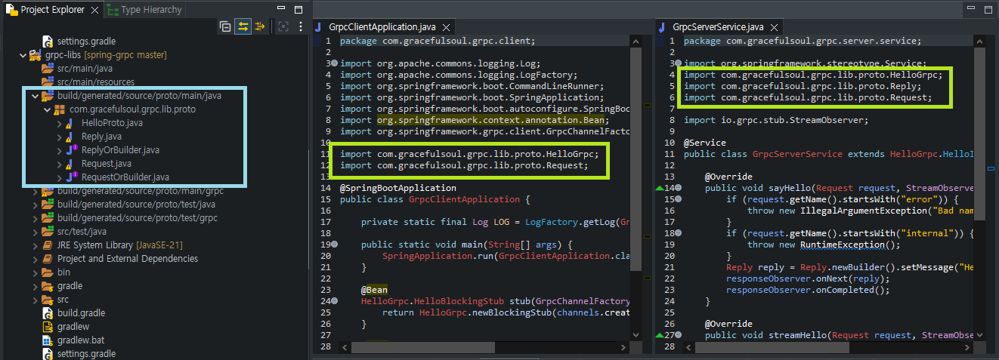

# Gradle[^Gradle]
- Gradle은 Groovy를 사용한 빌드 자동화 시스템으로, 주로 Java, C/C++, 파이썬 등의 언어를 지원한다.

# Gradle Multi Project
- Gradle [Multi Project Builds](https://docs.gradle.org/current/userguide/multi_project_builds.html){:target="_blank"}는 [Monorepo](https://en.wikipedia.org/wiki/Monorepo){:target="_blank"} 형태로 Root Project에서 Project 구조를 정의하고, Sub Project들을 파생하는 구조이다.

```groovy
my-project/
├── settings.gradle         
├── build.gradle        
├── app/                    
│   └── build.gradle    
├── core/                   
│   └── build.gradle    
└── util/                   
    └── build.gradle  
```
- 이 구조에서 특정 Sub Project에서 공통으로 사용하는 소스를 Sub Project로 관리하고 의존성을 주입하는 관계로 적용이 가능하다.

```groovy
.
├── api
│   ├── src
│   │   └──...
│   └── build.gradle
├── services
│   └── person-service
│       ├── src
│       │   └──...
│       └── build.gradle
├── shared
│   ├── src
│   │   └──...
│   └── build.gradle
└── settings.gradle
```
- 위와 같은 구성을 통해 공통된 소스들을 각 Project에 Copy/Paste 혹은 다중 관리에 대한 유지보수성을 저하시키는 요소를 제거할 수 있다.
- 물론 Maven에서도 동일한 구성의 [Multi Modules](https://maven.apache.org/guides/mini/guide-multiple-modules.html){:target="_blank"}가 존재하지만, 오늘은 Gradle의 Multi Project 구성에 대해서 이전 포스트인 [Spring gRPC](../spring/spring-grpc){:target="_blank"} 코드를 사용하여 설명을 진행한다.

# Example Project
```groovy
spring-grpc/
├── grpc-server
│   ├── src
│   │   └──...
│   └── build.gradle
├── grpc-client
│   └── src
│   │   └──...
│   └── build.gradle
├── grpc-libs
│   ├── proto
│   │   └──...
│   └── build.gradle
├── build.gradle
└── settings.gradle
```

## spring-grpc
```groovy
plugins {
  id 'java'
  id 'org.springframework.boot' version '3.4.5'
  id 'io.spring.dependency-management' version '1.1.7'
  id 'com.google.protobuf' version '0.9.2'
}

ext {
  set('springGrpcVersion', "0.10.0")
  set('springBootVersion', "3.4.5")
}

allprojects {
    group = 'com.gracefulsoul'
    version = '0.0.1-SNAPSHOT'

    repositories {
        mavenCentral()
        google()
        maven { url 'https://repo.spring.io/milestone' }
    }
}

subprojects {
    apply plugin: "java"
    apply plugin: 'io.spring.dependency-management'

    java {
        toolchain {
            languageVersion = JavaLanguageVersion.of(21)
        }
    }

  dependencyManagement {
    imports {
      mavenBom "org.springframework.grpc:spring-grpc-dependencies:${springGrpcVersion}"
      mavenBom "org.springframework.boot:spring-boot-dependencies:${springBootVersion}"
    }
  }
}
```
- 여기서 주목해야 하는 항목은 allprojects, subprojects이다.
  - allprojects는 모든 프로젝트에 공통으로 적용하기 위한 설정이다.
  - subprojects는 최상위 프로젝트를 제외한 하위 프로젝트에 공통으로 적용하기 위한 설정이다.
- 위 설정들은 각 프로젝트 내 build.gradle에 중복으로 설정되지 않도록 일괄 적용하기 위해 사용한다.

## grpc-libs
```groovy
plugins {
  id 'java-library'
  id 'com.google.protobuf' version '0.9.2'
}

jar {
    enabled = true
}

repositories {
    mavenCentral()
    google()
}

dependencies {
  implementation 'io.grpc:grpc-services:1.60.0'
}

protobuf {
  protoc {
    artifact = 'com.google.protobuf:protoc:3.25.3'
  }
  plugins {
    grpc {
      artifact = 'io.grpc:protoc-gen-grpc-java:1.64.0'
    }
  }
  generateProtoTasks {
    all()*.plugins {
      grpc {
        option 'jakarta_omit'
        option '@generated=omit'
      }
    }
  }
}
```
- 위 프로젝트는 라이브러리 형태로 각 프로젝트에 의존성 주입을 위한 프로젝트로, 'java-library' 플러그인을 사용한다.
- 이전 글에서 설명한 내용대로 protobuf를 사용하여 java 코드를 자동 생성할 것이므로, protobuf 관련 설정만 추가한다.

## grpc-server
```groovy
plugins {
  id 'java'
  id 'org.springframework.boot'
  id 'io.spring.dependency-management'
}

dependencies {
  implementation project(":grpc-libs")
  implementation 'io.grpc:grpc-services'
  implementation 'org.springframework.boot:spring-boot-starter'
  implementation 'org.springframework.grpc:spring-grpc-spring-boot-starter'

  testImplementation 'org.springframework.boot:spring-boot-starter-test'
  testImplementation 'org.springframework.grpc:spring-grpc-test'
  testRuntimeOnly 'org.junit.platform:junit-platform-launcher'
}

tasks.named('test') {
  useJUnitPlatform()
}
```
- grpc-server에서는 ```implementation project(":grpc-libs")```를 통해서 앞의 grpc-libs 프로젝트를 의존성 주입하여 사용하는 것을 명시한다.

## grpc-client
```groovy
plugins {
  id 'java'
  id 'org.springframework.boot'
  id 'io.spring.dependency-management'
}

dependencies {
  implementation project(":grpc-libs")
  implementation 'org.springframework.boot:spring-boot-starter'
  implementation 'org.springframework.grpc:spring-grpc-client-spring-boot-starter'

  testImplementation 'org.springframework.boot:spring-boot-starter-test'
  testImplementation 'org.springframework.grpc:spring-grpc-test'
  testRuntimeOnly 'org.junit.platform:junit-platform-launcher'
}

tasks.named('test') {
  useJUnitPlatform()
}
```
- grpc-client 또한 ```implementation project(":grpc-libs")```를 통해서 앞의 grpc-libs 프로젝트를 의존성 주입하여 사용하는 것을 명시한다.

# Conclusion

- 위와 같이 공통으로 사용하는 DTO와 Utility 등의 사이드 이펙트가 없는 [순수 함수](https://en.wikipedia.org/wiki/Pure_function){:target="_blank"}, 등의 다양한 목적의 공통 코드를 모듈화하여 공유한다.
- 쉽고 간편한 개발을 통해 만들어진 프로젝트는 깊은 고민과 설계를 통해 만들어진 프로젝트를 결코 따라잡지 못하므로, 코드를 먼저 작성하기보다는 더 나은 방안을 설계하고 고민하는 습관을 가졌으면 한다.

# Reference
[^Gradle]: [Gradle Home](https://gradle.org/){:target="_blank"}

※ Sample Code는 [여기](https://github.com/GracefulSoul/spring-grpc){:target="_blank"}에서 확인 가능합니다.