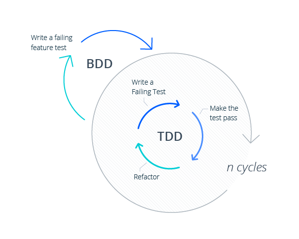

# Behavior-Driven Development(BDD)[^BDD]

  

- TDD에서 한 발 더 나아가 테스트 케이스 자체가 요구사양이 되도록 하는 개발 방식이다.
- 소프트웨어 개발은 ​​사용자의 요구를 충족한다.
- 업무상 중요한 기능이 먼저 제공된다.
- 모든 당사자는 프로젝트에 대한 공통의 이해를 가지고 있으며, 의사 소통에 참여할 수 있다.
- 공통 언어는 개발자와 비개발자를 포함한 모든 사람이 프로젝트의 진행 상황을 완벽히 파악할 수 있도록한다.
- 소프트웨어 설계는 기존 요구 사항을 충족하고 향후 비즈니스 요구 사항을 지원할 수 있도록 설계한다.
- 코드의 품질 개선으로 유지보수 비용을 절감하고 프로젝트 리스크를 최소화 한다.

# 시나리오 패턴
- Feature : 테스트에 대상의 기능/책임을 명시한다.
- Scenario : 테스트 목적에 대한 상황을 설명한다.
- Given : 시나리오 진행에 필요한 값을 설정한다.
- When : 시나리오를 진행하는데 필요한 조건을 명시한다.
- Then : 시나리오를 완료했을 때 보장해야 하는 결과를 명시한다.

# 테스트의 자동화
- 테스트를 자동화 함으로써, (Continuous integration)CI 단계에서 발생이 가능한 오류와 버그를 먼저 진단하여 안정적인 서비스 운영에 기여한다.

## 자동화 도구
- Cucumber[^Cucumber] : Behavior-Driven Development(BDD) 기반의 테스트 프레임워크이며 Gherkin이라는 문법을 사용한다.
- JBehave[^JBehave] : Behavior-Driven Development(BDD)를 위한 테스트 프레임워크이다.
- BeanSpec[^BeanSpec] : Behavior-Driven Development(BDD)를 위한 Java 솔루션으로, 선언적 & 서술적 스타일로 구성 요소의 동작을 지정, 확인 및 요약한다.

# Reference
[^BDD]: [Wiki-Behavior-Driven_Development](https://en.wikipedia.org/wiki/Behavior-driven_development)
[^Cucumber]: [Cucumber-Home](https://cucumber.io/)
[^JBehave]: [JBehave-Home](https://jbehave.org/)
[^BeanSpec]: [BeanSpec-SourceForce](https://sourceforge.net/p/beanspec/wiki/Home/)