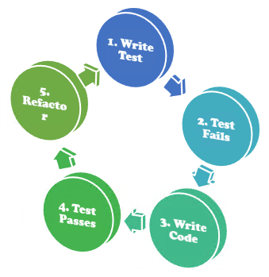

# Test-Driven Development(TDD)[^TDD]
- 매우 짧은 개발 서클의 반복을 갖는 소프트웨어 개발 프로세스이다.
- 먼저 테스트를 먼저 작성하고 실제 코드를 작성하기 때문에 테스트 되지 않는 코드가 없어진다. 즉, 모든 코드가 테스트되기 때문에 버그의 발생 가능성이 줄어든다.
- 테스트가 요구사항을 분명하게 드러나게 해주는 효과가 있고, 테스트에 적합하게 구현하다보면 프로그램의 디자인이 단순화되는 경향이 있다.
- 테스트가 잘 작성되어 있으면 프로그램의 변경 작업을 할 때 사이드 이펙트가 발생하는 것을 쉽게 확인 가능하므로 변경 작업을 쉽게 할 수 있게 된다. 즉, 개발 과정의 유연성이 높아지고 생산성이 향상된다.

# 과정

  

  * 개발자는 먼저 요구사항을 검증하는 자동화된 테스트 케이스를 작성한다.
  * 그런 후에, 그 테스트 케이스를 통과하기 위한 최소한의 코드를 생성한다.
  * 마지막으로 작성한 코드를 표준에 맞도록 리팩토링한다.

# 테스트의 자동화
- 테스트를 자동화 함으로써, (Continuous integration)CI 단계에서 발생이 가능한 오류와 버그를 먼저 진단하여 안정적인 서비스 운영에 기여한다.

## 자동화 도구
- JUnit[^JUnit] : Java 및 JVM을 위한 테스트 프레임워크이다.
- Selenium[^Selenium] : 브라우저 기반의 웹 어플리케이션 테스트 자동화 도구이다.
- Mockito[^Mockito] : Java UnitTest를 위한 테스트 프레임워크이다.
- Spock[^Spock] : Java 및 Groovy 애플리케이션을 위한 테스트 프레임워크이다.

# Reference
[^TDD]: [Wiki-테스트_주도_개발](https://ko.wikipedia.org/wiki/%ED%85%8C%EC%8A%A4%ED%8A%B8_%EC%A3%BC%EB%8F%84_%EA%B0%9C%EB%B0%9C){:target="_blank"}
[^JUnit]: [JUnit-Home](https://junit.org/junit5/){:target="_blank"}
[^Selenium]: [Selenium-Home](https://www.selenium.dev/){:target="_blank"}
[^Mockito]: [Mokito-Home](https://site.mockito.org/){:target="_blank"}
[^Spock]: [Spock-Home](https://spockframework.org/){:target="_blank"}