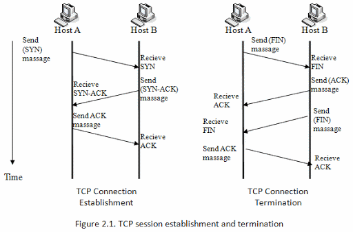

# Internet Protocol Suite
- 인터넷에서 컴퓨터들이 서로 정보를 주고받는 데 쓰이는 통신규약(프로토콜)의 모음이다.[^InternetProtocolSuite]
- 인터넷 프로토콜 스택은 보통 네 계층으로 나눌 수 있다.

| 계층 | 프로토콜 |
|:--------|:--------|
| 응용 계층 | BGP, DHCP, DNS, FTP, HTTP, HTTPS, IMAP, LDAP, MGCP, MQTT, NNTP, NTP, POP, ONC/RPC, RTP, RTSP, RIP, SIP, SMTP, SNMP, SSH, Telnet, TLS/SSL, XMPP, ... |
| 전송 계층 | TCP, QUIC, UDP, DCCP, SCTP, RSVP, ... |
| 인터넷 계층 | IP(IPv4, IPv6), ARP, ICMP, ICMPv6, ECN, IGMP, IPsec, ... |
| 링크 계층 | NDP, OSPF, 터널(L2TP), PPP, MAC(이더넷, DSL, ISDN, FDDI), ... |

# User Datagram Protocol(UDP)
- TCP와 함께 데이터그램으로 알려진 단문 메시지를 교환하기 위해서 사용된다. 
- UDP의 전송 방식은 너무 단순해서 서비스의 신뢰성이 낮고, 데이터그램 도착 순서가 바뀌거나, 중복되거나, 심지어는 통보 없이 누락시키기도 한다.
- 주로 DNS, IPTV, VoIP, TFTP 등에서 사용한다.

# Transmission Control Protocol(TCP)
- UDP에 비해 신뢰성과 순차적인 전달을 제공하며, 송신자와 수신자 모두가 소켓이라는 종단점을 생성함으로써 신뢰성있는 바이트 스트림을 전송하도록 설계되었다.
- TCP는 웹 브라우저들이 월드 와이드 웹에서 서버에 연결할 때 사용되며, 이메일 전송이나 파일 전송에도 사용된다.

- 3-way Handshaking : TCP 통신을 이용하여 데이터를 전송하기 위해 네트워크 연결을 설정(Connection Establish)하는 과정이다.
- 4-way Handshaking : TCP의 연결을 해제(Connection Termination)하는 과정이다.

## TCP Control Flag
### SYN, Synchronize
- TCP 연결을 시작하며 회선을 개설하는 용도이며, 연결을 요청하고 허락할 때 세워진다.
- 즉, 3-Way Handshake를 시작하는 플래그며 두 호스트의 첫 번째 비트에만 세워진다.

### ACK, Acknowledgement
- Acknowledgement number 값이 설정되어 유효하다는 것을 의미하며, 전송을 제대로 받았다는 증거가 된다.
- SYN 플래그를 받으면 이 플래그를 보내며 이후 모든 세그먼트에는 항상 이 플래그가 세워져 있다. 값은 Sequence number에 1을 더한 값이 된다.

### URG, Urgent
- 이 플래그가 세워지면 수신자에게 다른 패킷보다 해당 패킷을 먼저 처리하도록 요청한다.

### PSH, Push
- 받은 패킷을 버퍼링하지 않고 즉시 처리하도록 요청한다.
- 예를 들어 패킷을 상위 계층 응용프로그램에 빠르게 전달하도록 하며 URG와 비슷하다고 볼 수 있다.

### RST, Reset
- 연결이 확립(Established)된 회선에 강제로 리셋을 요청한다.

### FIN, Finish
- 이 플래그가 세워진 세그먼트를 받아 ACK 플래그를 세워 응답하면 연결이 종료된다.

# Internet Protocol(IP)
- 송신 호스트와 수신 호스트가 패킷 교환 네트워크에서 정보를 주고받는 데 사용하는 정보 위주의 규약이다.
- IP는 흐름에 관여하지 않기 때문에 보낸 정보가 제대로 갔는지 보장하지 않는다는 비신뢰성(Unreliability)과 비연결성(Connectionlessness)이 특징이다.
- TCP/IP는 패킷을 수집하는 것만으로도 도청이 가능하여 암호화 하여 전송해야 한다.

## IPv4 vs IPv6

| 구분 | IPv4 | IPv6 |
|:--------|:--------|:--------|
| 주소 길이 | 32bit | 128bit |
| 주소 개수 | $2^{32}$인 4,294,967,296개 | $2^{128}$인 약 $3.4\times10^{38}$개 |
| 품질 제어 | 베스트 에퍼트 방식으로 품질 보장이 곤란 (타입이나 서비스에 대한 QoS 일부 지원) | 등급별, 서비스 별로 패킷을 구분할 수 있어 품질 보장이 용이 (트래픽 클라스, 폴로 라벨에 의한 QoS 지원) |
| 보안 기능 | IPsec 프로토콜 별도 설치 | 확장 기능에서 기본으로 제공 |
| Plug & Play | 없음 | 있음(오디오 컨피큐어레이션 가능) |
| Mobile IP | 곤란(비효율적) | 용이(효율적) |
| Web Casting | 곤란 | 용이(스코프 필드 증가) |

# HyperText Transfer Protocol(HTTP)
- 클라이언트와 서버 사이에 이루어지는 요청/응답(Request/Response) 프로토콜이다. 
- HTTP는 평문(ASCII) 메시지 통신이기 때문에 도청이 가능하다.
- 통신 상대를 확인하지 않기 때문에 위장이 가능하다.

## [Request Method](https://developer.mozilla.org/en-US/docs/Web/HTTP/Methods){:target="_blank"}
### GET
- Request-URI로 식별되는 모든 정보(엔티티 형식)를 검색하는 것을 의미한다. 

### HEAD
- 서버가 응답에서 메시지 본문을 반환하지 않아야한다는 점을 제외하고 GET과 동일하다.

### POST
- 요청 라인에서 요청 URI에 의해 식별된 자원의 새로운 종속 항목으로 요청에 포함된 엔티티를 원 서버가 수락하도록 요청하는데 사용된다.

### PUT
- PUT 메소드는 같이 전달된 엔티티가 제공된 Request-URI 아래에 저장되도록 요청한다.

### DELETE
- Request-URI로 식별 된 자원을 원 서버가 삭제하도록 요청한다.

### CONNECT
- 목적 리소스로 식별되는 서버로의 터널을 맺는다.

### OPTIONS
- Request-URI로 식별되는 요청 / 응답 체인에서 사용할 수있는 통신 옵션에 대한 정보 요청을 나타낸다.

### TRACE
- 요청 메시지의 원격 애플리케이션 계층 Loop-Back을 호출하는 데 사용됩니다

### PATCH
- PATCH 메서드는 리소스의 부분만을 수정하는 데 쓰인다.

## [Status](https://developer.mozilla.org/en-US/docs/Web/HTTP/Status){:target="_blank"}

| Status code | Description |
|:--------|:--------|
| 100 ~ 199 | Informational Responses |
| 200 ~ 299 | Successful Responses |
| 300 ~ 399 | Redirects |
| 400 ~ 499 | Client errors |
| 500 ~ 599 | Server errors |

## [Headers](https://developer.mozilla.org/en-US/docs/Web/HTTP/Headers){:target="_blank"}
### General Headers
- Request와 Response 모두에 사용되며, 최종적으로 전송되는 Body의 데이터와는 관련이 없는 Header이다.

### Request Headers
- 가져올 Resource 또는 Resource를 요청하는 Client에 대한 추가 정보를 제공하는 Header이다.

### Response headers
- Response의 위치 또는 Response를 제공하는 Server에 대한 추가 정보를 제공하는 Header이다.

### Entity headers
- 컨텐츠 길이나 MIME 타입과 같이 Resource 본문에 대한 정보를 포함하는 Header이다.

# HyperText Transfer Protocol over Secure Socket Layer(HTTPS)
- HTTP 프로토콜의 보안적인 부분을 해결하기 위해 HTTP 통신하는 소켓부분을 TCP에서 SSL(Secure Socket Layer) or TLS(Transport Layer Security)라는 프로토콜로 대체함으로써 암호화와 증명서, 안정성 보호를 이용할 수 있게 된다.

# Reference
[^InternetProtocolSuite]: [Wiki-인터넷_프로토콜_스위트](https://ko.wikipedia.org/wiki/%EC%9D%B8%ED%84%B0%EB%84%B7_%ED%94%84%EB%A1%9C%ED%86%A0%EC%BD%9C_%EC%8A%A4%EC%9C%84%ED%8A%B8){:target="_blank"}