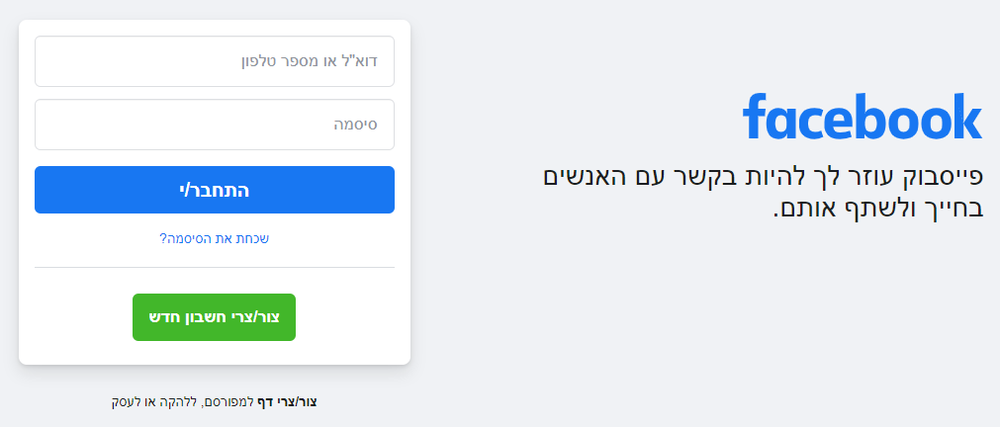
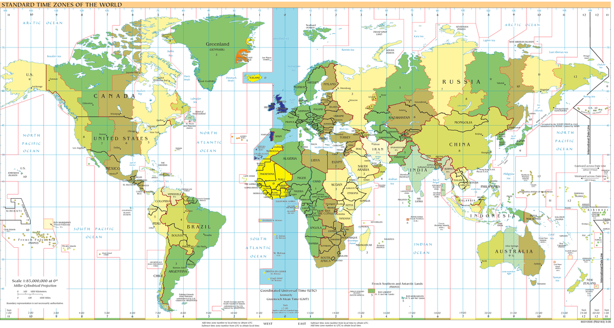
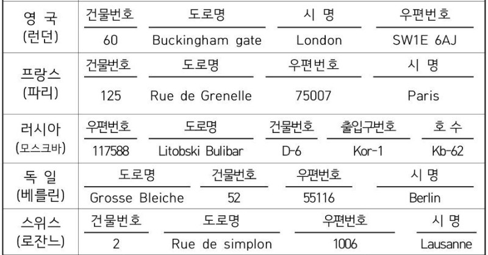

# Internationalization(I18N), 국제화
- 문화, 지역 또는 언어가 다양한 대상 고객을 위해 쉽게 L10N(현지화) 할 수 있는 디자인 및 개발이다.

## 소프트웨어의 국제화
- 번역, 문자 인코딩, 문자열 치환을 지원한다.

## 디자인의 국제화
- 소스 코드의 변경 없이도 다양한 언어/지역을 지원 할 수 있도록 처리해야 한다.

## 리소스의 국제화
- 언어/지역에 맞춰 가장 적절한 리소스를 준비해야한다.

# Localization(L10N), 지역화
- 특정 목표 시장(국가)의 문화 및 기타 요구 사항을 충족시키는 작업이다.

## LTR/RTL(쓰기 방향의 차이)
### LTR

### RTL

## 숫자, 화폐, 날짜 및 시간 형식
### 숫자

| 국가 | 숫자 표기 |
|:--------|:--------|
| 캐나다 | 1,234.00 |
| 덴마크 | 1.234.567,00 |
| 핀란드 | 1 234 567,00 |

### 화폐

| 국가 | 통화 | 화폐 표기 |
|:--------|:--------|:--------|
| 캐나다 | $ | $1,234.56 |
| 덴마크 | kr | Kr 1.234,56 |
| 핀란드 | € | 	€1 234,56 |

### 날짜

| 국가 | 형식 | 날짜 표기 |
|:--------|:--------|:--------|
| 캐나다 | dd/mm/yy | 24/03/21 |
| 덴마크 | yyyy-mm-dd | 2021-03-24 |
| 핀란드 | dd.mm.yyyy | 24.03.2021 |

### UTC

## [문자열 정렬 방법](https://namu.wiki/w/%EC%A0%95%EB%A0%AC/%EC%88%9C%EC%84%9C){:target="_blank"}
- 한국어
대한민국 표준어에서 사용되는 정렬 순서는 다음과 같다. 대개 가나다순이라고 한다.
  - 초성: ㄱ ㄲ ㄴ ㄷ ㄸ ㄹ ㅁ ㅂ ㅃ ㅅ ㅆ ㅇ ㅈ ㅉ ㅊ ㅋ ㅌ ㅍ ㅎ
  - 중성: ㅏ ㅐ ㅑ ㅒ ㅓ ㅔ ㅕ ㅖ ㅗ ㅘ ㅙ ㅚ ㅛ ㅜ ㅝ ㅞ ㅟ ㅠ ㅡ ㅢ ㅣ
  - 종성: (없음) ㄱ ㄲ ㄳ ㄴ ㄵ ㄶ ㄷ ㄹ ㄺ ㄻ ㄼ ㄽ ㄾ ㄿ ㅀ ㅁ ㅂ ㅄ ㅅ ㅆ ㅇ ㅈ ㅊ ㅋ ㅌ ㅍ ㅎ

- 라틴 문자
기본적인 정렬 순서는 아래와 같고 모든 글자 사이에 Primary Difference가 있으나, 언어에 따라서 조금씩 차이가 있다.
  - A B C D E F G H I J K L M N O P Q R S T U V W X Y Z

- 키릴 문자
기본적인 정렬 순서는 아래와 같다. 각 글자 사이에 Primary Difference가 있으나, 언어에 따라서 조금씩 차이가 있다. Diacritic이 붙은 문자와 Diacritic이 붙지 않은 문자 사이에는 Secondary Difference가 있다.
  - А Б В Г Д Е Ж З И Й К Л М Н О П Р С Т У Ф Х Ц Ч Ш Щ Ъ Ы Ь Э Ю Я

## 개인 이름 및 주소 형식 처리 등
### [개인 이름](https://namu.wiki/w/%EC%84%B1%EC%94%A8){:target="_blank"}
- 동아시아나 헝가리 등지에서는 이름 앞에 쓰고, 유럽(헝가리 제외)이나 중동, 터키, 인도, 아메리카에서는 뒤에 쓴다.
- 대부분의 문화권에서 성이 있지만 지금도 아랍인과 말레이인처럼 성이 없는 문화권이 있다.

### 주소 형식

### 우편번호
#### 한국
- 2015년 8월 1일부터 국가기초구역에 부여된 5자리 구역번호인 국가기초구역번호를 우편번호로 사용한다.

#### 일본
- 3자리의 발송용 번호와 4자리의 숫자를 이용한다. 〒100-0000은 도쿄도 지요다구의 우편번호이다.

#### 미국 
- Postal code(postcode) 혹은 ZIP code라고 불리는 독자적인 형식의 우편번호 양식을 사용하고 있다.
- 일반적으로 5자리의 발송용 번호(ZIP)로 대표되는 지역을 세분화하여 4자리의 숫자를 추가할 수 있도록 해놓았다.

## 지역의 관습
- 용지 크기
- 전화 번호 형식
- 측정 시스템
- 배터리 크기
- 전압 및 전류 표준

## 다양한 법적 요건
- 개인 정보 보호 법률 준수
- 웹 사이트에 대한 추가 면책 조항
- 다양한 소비자 라벨링 요구 사항
- 수출 제한 준수 및 암호화
- 인터넷 검열 정권 또는 소환 절차
- 접근성에 대한 요구사항
- 세금 징수에 대한 규정(Ex. 판매 세 , 부가가치세 또는 관세)
- 지리적 명명 분쟁 및 <87과 같은 다양한 정치적 문제에 대한 민감도>분쟁 된 국경 지도에 표시 (Ex. 인도는 카슈미르 및 정부가 의도 한 기타 지역을 범죄로 표시하지 않는 논란이 있는 법안을 제안했다.)

# Reference
- [NamuWiki-성씨](https://namu.wiki/w/%EC%84%B1%EC%94%A8){:target="_blank"}
- [NamuWiki-정렬/순서](https://namu.wiki/w/%EC%A0%95%EB%A0%AC/%EC%88%9C%EC%84%9C){:target="_blank"}
- [NaverBlog-세계의 주소 체계](https://m.blog.naver.com/edizon426/220737608336){:target="_blank"}
- [Wikipedia-국제화 및 현지화](https://ko.wikiarabi.org/wiki/Internationalization_and_localization){:target="_blank"}