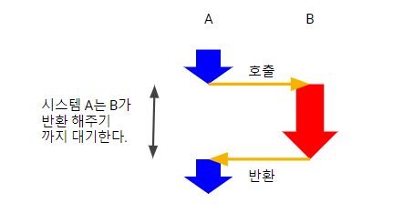
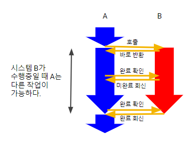
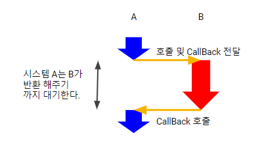
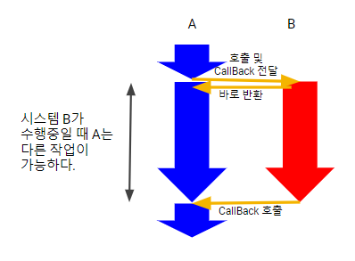

# Synchronous/Asynchronous
- 호출되는 함수의 작업 완료 여부를 누가 신경쓰는지가 관심사이다.

## Synchronous
- 호출한 함수가 호출되는 함수의 작업 완료를 지속적으로 확인한다.

## Asynchronous
- 호출한 함수는 작업 완료 여부를 신경쓰지 않으며 호출되는 함수에게 Callback을 전달한다.
- 호출되는 함수의 작업이 완료되면 전달받은 Callback을 실행한다.

# Blocking/NonBlocking
- 호출되는 함수가 바로 반환하는지가 관심사이다.

## Blocking
- 호출된 함수가 자신의 작업을 모두 마칠 때까지 호출한 함수에게 제어권을 넘겨주지 않고 대기하게 만든다.

## Non-Blocking
- 호출된 함수가 바로 반환해서 호출한 함수에게 제어권을 넘겨주고, 호출한 함수가 다른일을 할 수 있는 기회를 준다.

# Synchronous-Blocking

- 호출된 함수에서 제어권을 반환하지 않아, 호출한 함수는 호출된 함수가 끝날 때까지 다른 일을 하지 못하고 기다려야 한다.

# Synchronous-NonBlocking

- 호출된 함수에서 제어권을 바로 반환하여, 호출한 함수는 다른 일을 수행할 수 있다.
- 호출한 함수는 호출된 함수가 완료되었는지를 주기적으로 확인한다.

# Asynchronous-Blocking

- 호출한 함수는 CallBack을 전달하지만 호출된 함수에서 제어권을 반환하지 않아, 호출한 함수는 호출된 함수가 끝날 때까지 다른 일을 하지 못하고 기다려야 한다.

# Asynchronous-NonBlocking

- 호출된 함수에서 제어권을 바로 반환하여, 호출한 함수는 다른 일을 수행할 수 있다.
- 호출된 함수에서 작업이 완료되면 CallBack을 수행함으로써, 호출한 함수는 완료되었는지 확인 할 필요가 없다.
- 대표적으로 NodeJS, WebSocket가 이에 해당한다.