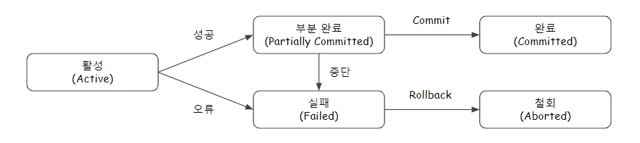

# Transaction
- 은행 ATM이나 데이터베이스 등의 시스템에서 사용되는 더 이상 쪼갤 수 없는 업무 처리의 최소 단위이다.

# ACID
## 원자성(Atomicity)
트랜잭션의 연산은 데이터베이스에 모두 반영되든지 아니면 전혀 반영되지 않아야 한다.
## 일관성(Consistency)
시스템이 가지고 있는 고정요소는 트랜잭션 수행 전과 트랜잭션 수행 완료의 상태가 같아야 한다.
## 독립성(Isolation)
수행 중인 트랜잭션은 완전히 완료될 때까지 다른 트랜잭션에서 수행 결과를 참조할 수 없다.
## 지속성(Durability)
성공적으로 완료된 트랜잭션의 결과는 시스템이 고장나더라도 영구적으로 반영되어야 한다.

# 트랜잭션 상태(Status)

## 활성(Active)
트랜잭션이 실행 중인 상태이다.
## 실패(Failed)
트랜잭션 실행에 오류가 발생하여 중단된 상태이다.
## 철회(Aborted)
트랜잭션이 비정상적으로 종료되어 Rollback 연산을 수행한 상태이다.
## 부분 완료(Partially Committed)
트랜잭션의 마지막 연산까지 실행하고, Commit 연산이 실행되기 직전의 상태이다.
## 완료(Committed)
트랜잭션이 성공적으로 종료되어 Commit 연산을 실행한 후의 상태이다.

# 트랜잭션 연산(Operation)
## Commit
모든 작업들을 정상적으로 처리하겠다고 확정하는 명령어로서, 처리과정을 데이터베이스에 영구적으로 저장하는 것이다.

## Rollback
작업 중 문제가 발생하여 트랜잭션의 처리과정에서 발생한 변경사항을 취소하는 명령어이다.

## Save Point
롤백을 명시하면 삽입, 삭제, 업데이트 등의 작업 전체가 취소되는데, 세이브포인트는 전체가 아닌 특정 부분에서 트랜잭션을 취소하기 위해 사용한다.

# 트랜잭션 병행 제어(Concurrency Control)
여러 트랜잭션들이 동시에 실행되면서도 데이터베이스의 일관성을 유지할 수 있게 하는 기법이다.

## 목적
- 데이터베이스의 일관성을 유지한다.
- 데이터베이스의 공유를 최대화한다.
- 시스템의 활용도를 최대화한다.
- 사용자의 응답시간을 최소화한다.

## 병행 제어 실패 현상
자원에 대한 경쟁 상태(Race Condition)에서 발생하는 문제이다.

### Dirty Write
두 개 이상의 트랜잭션이 같은 데이터를 동시에 바꾸고자하는 문제이다.

### Dirty Read
커밋 전 데이터 조회와 롤백 후 데이터 조회의 데이터가 불일치되는 문제이다.

### Non-repeatable Read
한 트랜잭션에서 데이터 변경 전과 후 같은 조회 쿼리를 수행 시, 조회된 값이 변경되면서 결과가 달라지는 문제이다.

### Phantom Read
한 트랜잭션에서 데이터 추가 전과 후 일정 범위의 레코드를 조회 시, 값이 추가(Phantom Tuple)되면서 결과가 달라지는 문제이다.

### Cascade Rollback
두 개 이상의 Transaction이 수행되던 중 한 개의 Transaction이 취소될 때 나머지 다른 Transaction도 연쇄적으로 취소되는 현상.

## 병행 제어 기법
### Locking
- 트랜잭션이 어떤 데이터에 접근하고자 할 때, 다른 트랜잭션이 접근할 수 없게 하는 기법이다.
- 필드, 레코드, 파일, 데이터베이스 모두 Locking 단위가 될 수 있다.
- Locking 단위가 크면, 관리하기 용이(오버헤드 감소)하지만 병행성(동시성) 수준이 낮아진다.
- Locking 단위가 작으면, 병행성(동시성) 수준이 높아지지만 관리가 난해(오버헤드 증가)하다.

### 2단계 로킹 규약(Two-Phase Locking Protocol)
- Lock과 Unlock이 동시에 이루어지면 일관성이 보장되지 않으므로, Lock만 가능한 단계와 Unlock만 가능한 단계를 구분하는 기법이다.
- 직렬가능성을 보장하며, 교착상태가 발생할 수 있다.
- 확장 단계 : 새로운 Lock은 가능하고 Unlock은 불가능하다.
- 축소 단계 : Unlock 은 가능하고 새로운 Lock은 불가능하다.

### Time Stamp
- 데이터에 접근하는 시간을 미리 정해서 정해진 시간(Time Stamp)의 순서대로 데이터에 접근하여 수행하는 기법이다.
- 직렬가능성을 보장하며, 교착상태가 발생하지 않는다.
- 연쇄복귀(Cascading Rollback)를 초래할 수 있다.

### 낙관적 병행제어(Optimistic Concurrency Control)
- 트랜잭션 수행 동안은 어떠한 검사도 하지 않고, 트랜잭션 종료 시에 일괄적으로 검사하는 기법이다.
- 트랜잭션 수행 동안 그 트랜잭션을 위해 유지되는 데이터 항목들의 지역 사본에 대해서만 갱신한다.
- 트랜잭션 종료 시에 동시성을 위한 트랜잭션 직렬화가 검증되면 일시에 DB로 반영한다.

### 다중 버전 병행제어(Multi-Version Concurrency Control)
- 여러 버전의 타임스탬프를 비교하여 스케줄상 직렬가능성이 보장되는 타임스탬프를 선택하는 기법이다.
- 동시 접근을 허용하는 데이터베이스에서 동시성을 제어하기 위해 사용하는 방법 중 하나이다.
  * Locking을 필요하지 않아서 일반적인 RDBMS보다 빠르게 작동한다.
  * 미사용 데이터가 계속 쌓이게 되므로 주기적으로 삭제하는 시스템이 필요하다.
  * 여러 버전의 데이터를 허용하기 때문에 버전이 충돌날 수 있으며, 이는 애플리케이션 영역에서 해결해야 한다.

# Undo & Redo
## Undo
트랜잭션 로그를 이용하여 오류와 관련된 모든 변경을 취소하여 복구를 수행한다.
## Redo
트랜잭션 로그를 이용하여 오류가 발생한 트랜잭션을 재실행하여 복구를 수행한다.

# 트랜잭션 회복 기법(Recovery)
## 로그 기반(Log-based) Recovery
### 지연 갱신(Deferred Update)
- 트랜잭션의 Partially Committed 상태에서는 변경 내용을 로그 파일에만 저장한다.
- Commit 연산을 실행하기 전까진 데이터베이스에 기록하지 않는다.
- 중간에 장애가 생기더라도 데이터베이스에 기록되지 않았으므로 UNDO가 필요 없다.(미실행 된 로그 폐기)

### 즉시 갱신(Immediate Update)
- 트랜잭션 수행 도중에도 변경 내용을 즉시 데이터베이스에 기록한다.
- Commit 연산을 실행하기 이전의 갱신은 원자성이 보장되지 않는 미완료 갱신이므로 장애 발생 시 UNDO가 필요하다.

## 검사점(Checkpoint) Recovery
- 장애 발생 시 Checkpoint 이전에 처리된 트랜잭션은 회복에서 제외하고, Checkpoint 이후에 처리된 트랜잭션은 회복 작업 수행한다.
  - Commit 연산이 완료된 이후 Checkpoint를 지나서 장애가 발생이 되면 Redo를 수행한다.
  - 장애 발생 시점까지 Commit 연산이 수행되지 못한 경우 Undo를 수행한다.

## 미디어(Media) Recovery
- 디스크와 같은 비휘발성 저장 장치가 손상되는 장애가 발생할 상황을 대비한 회복 기법이다.
- 데이터베이스 내용을 백업, 미러링, RAID등을 통해 별도의 물리적 저장장치에 덤프를 수행한다.
- 미디어 장애 시 가장 최근 덤프로 복구하고 로그 파일을 참조해 덤프 이후의 작업까지 Redo를 수행한다.
- Undo는 사용하지 않는다.

## ARIES Recovery
### REDO 중 Repeating history
- 붕괴가 발생했을 때의 데이터베이스 상태를 복구하기 위하여 붕괴 발생 이전에 수행했던 모든 연산을 다시 한번 수행한다.
- 붕괴가 발생했을 때 완료되지 않은 상태인 진행 트랜잭션은 UNDO를 수행한다.
### UNDO 중 Logging
- UNDO를 할 때에도 로깅을 함으로써 회복을 수행하는 도중에 실패하여 회복을 다시 시작할 때에 이미 완료된 UNDO 연산은 반복하지 않는다.