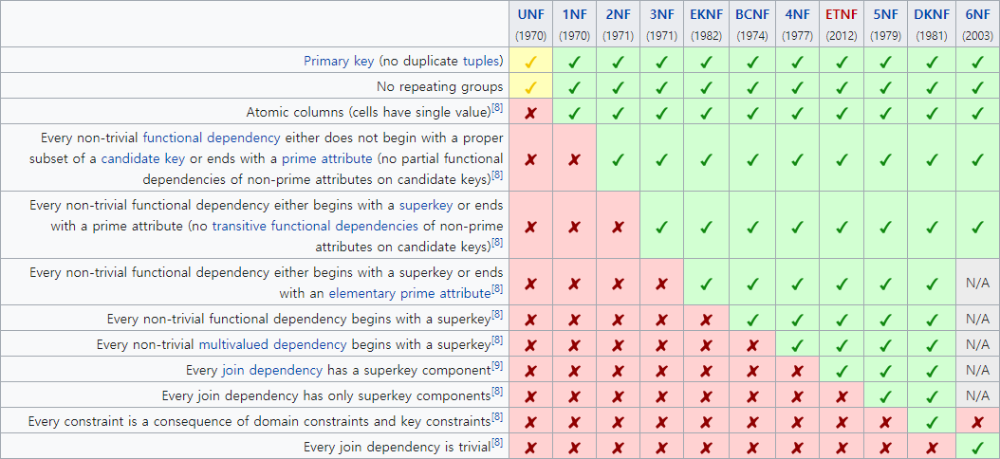

# Normalization
- 관계형 데이터베이스의 설계에서 중복을 최소화하게 데이터를 구조화하는 프로세스이다.
- 데이터베이스 정규화의 목표는 이상(Anomaly)이 있는 관계를 재구성하여 작고 잘 조직된 관계를 생성하는 것에 있다.

# 목적
- 중복을 배제하여 삽입, 삭제, 갱신 이상의 발생을 방지한다.
- 각 릴레이션에 중복된 종속성을 여러 개의 릴레이션에 분할한다.
- 어떠한 릴레이션이라도 데이터베이스 내에서 표현 가능하게 한다.
- 데이터 삽입 시 릴레이션을 재구성할 필요성을 감소시킨다.
- 효과적인 검색 알고리즘을 생성 가능하게 한다.

# Anomaly, 이상
- 충분히 정규화되지 않은 테이블에서 테이블을 수정(갱신, 삽입, 삭제)시, 원치 않던 부작용이 발생하는 것이다.

## Update Anomaly, 갱신 이상

- 튜플 수정 시 중복된 데이터의 일부만 수정되어 일어나는 데이터 불일치 현상이다.

## Insertion Anomaly, 삽입 이상

- 튜플 삽입 시 특정 속성에 해당하는 값이 없어 NULL을 입력해야 하는 현상이다.

## Deletion Anomaly, 삭제 이상

- 튜플 삭제 시 같이 저장된 다른 정보까지 연쇄적으로 삭제되는 현상이다.

# 과정

- 비공식적으로 "관계형 데이터베이스 테이블(컴퓨터 공학적 표현으로는 관계)이 제 3정규(3NF)화가 되었으면 정규화 되었다."라고 한다.
- 일반적으로 2002년에 소개된 [6NF](https://en.wikipedia.org/wiki/Sixth_normal_form){:target="_blank"}는 정규화 대상에서 제외된다.

## 1NF

| Customer ID | First Name | Surname | Telephone Number |
|:--------|:--------|:--------|:--------|
| 123 | Pooja | Singh | 555-861-2025, 192-122-1111 |
| 456 | San | Zhang | (555) 403-1659 Ext. 53; 182-929-2929 |
| 789 | John | Doe | 555-808-9633 |

- 위의 도표에서 Telephone Number는 한 컬럼에 단일 값(원자값)이 아니다.

| Customer ID | First Name | Surname | Telephone Number1 | Telephone Number2 |
|:--------|:--------|:--------|:--------|:--------|
| 123 | Pooja | Singh | 555-861-2025 | 192-122-1111 |
| 456 | San | Zhang | (555) 403-1659 Ext. 53 | 182-929-2929 |
| 789 | John | Doe | 555-808-9633 | |

- 컬럼을 분리하여 단일 값이 들어가도록 수정하였다.

## 2NF

| Manufacturer | Model | Model full name | Manufacturer country |
|:--------|:--------|:--------|:--------|
| Forte | X-Prime | Forte X-Prime | Italy |
| Forte | Ultraclean | Forte Ultraclean | Italy |
| Dent-o-Fresh | EZbrush | Dent-o-Fresh EZbrush | USA |
| Brushmaster | SuperBrush | Brushmaster SuperBrush | USA |
| Kobayashi | ST-60 | Kobayashi ST-60 | Japan |
| Hoch | Toothmaster | Hoch Toothmaster | Germany |
| Hoch | X-Prime | Hoch X-Prime | Germany |

- 기본 키를 Model full name으로 지정했더라도 다른 후보 키인 Manufacturer, Model이 있기 때문에 2NF를 위반한다.

| Manufacturer | Manufacturer country |
|:--------|:--------|
| Forte | Italy |
| Dent-o-Fresh | USA |
| Brushmaster | USA |
| Kobayashi | Japan |
| Hoch | Germany |
| Electric | toothbrush models |

| Manufacturer | Model | Model full name |
|:--------|:--------|:--------|
| Forte | X-Prime | Forte X-Prime |
| Forte | Ultraclean | Forte Ultraclean |
| Dent-o-Fresh | EZbrush | Dent-o-Fresh EZbrush |
| Brushmaster | SuperBrush | Brushmaster SuperBrush |
| Kobayashi | ST-60 | Kobayashi ST-60 |
| Hoch | Toothmaster | Hoch Toothmaster |
| Hoch | X-Prime | Hoch X-Prime |

- 테이블을 두 개로 분리하여 부분적 함수 종속을 제거한다.

## 3NF

| Tournament | Year | Winner | Winner's date of birth |
|:--------|:--------|:--------|:--------|
| Indiana Invitational | 1998 | Al Fredrickson | 21 July 1975 |
| Cleveland Open | 1999 | Bob Albertson | 28 September 1968 |
| Des Moines Masters | 1999 | Al Fredrickson | 21 July 1975 |
| Indiana Invitational | 1999 | Chip Masterson | 14 March 1977 |

- 복합 키 (Tournament, Year)는 행을 고유하게 식별 할 수 있는 테이블의 후보 키이다.
- Winner's date of birth가 Winner에 의존한다는 사실은 동일한 사람이 다른 기록에 생년월일이 다르게 기입되는 것을 막을 수 없기 때문에 테이블이 논리적 불일치에 취약하게 만들어 3NF를 위반한다.

| Tournament | Year | Winner |
|:--------|:--------|:--------|
| Indiana Invitational | 1998 | Al Fredrickson |
| Cleveland Open | 1999 | Bob Albertson |
| Des Moines Masters | 1999 | Al Fredrickson |
| Indiana Invitational | 1999 | Chip Masterson |

| Winner | Date of birth |
|:--------|:--------|
| Chip Masterson | 14 March 1977 |
| Al Fredrickson | 21 July 1975 |
| Bob Albertson | 28 September 1968 |

- 테이블을 두 개로 분리하여 Winner의 Date of birth가 다르게 기입이 불가능하므로, 이행적 함수 종속을 제거한다.

## BCNF

| Court | Start time | End time | Rate type |
|:--------|:--------|:--------|:--------|
| 1 | 09:30 | 10:30 | SAVER |
| 1 | 11:00 | 12:00 | SAVER |
| 1 | 14:00 | 15:30 | STANDARD |
| 2 | 10:00 | 11:30 | PREMIUM-B |
| 2 | 11:30 | 13:30 | PREMIUM-B |
| 2 | 15:00 | 16:30 | PREMIUM-A |

- 모든 속성은 어떤 후보 키에 속하므로 2NF와 3NF를 모두 준수한다.

| Rate type | Court Member | flag |
|:--------|:--------|:--------|
| SAVER | 1 | Yes |
| STANDARD | 1 | No |
| PREMIUM-A | 2 | Yes |
| PREMIUM-B | 2 | No |

| Member flag | Court | Start time | End time |
|:--------|:--------|:--------|:--------|
| Yes | 1 | 09:30 | 10:30 |
| Yes | 1 | 11:00 | 12:00 |
| No | 1 | 14:00 | 15:30 |
| No | 2 | 10:00 | 11:30 |
| No | 2 | 11:30 | 13:30 |
| Yes | 2 | 15:00 | 16:30 |

- 첫 테이블의 후보키는 Rate type 혹은 복합키인 (Court Member, flag)이다.
- 다음 테이블의 후보키는 복합키인 (Court, Start time) 혹은 (Court, End time)이다.
- Rate type이 첫 테이블의 키인 경우, 두 개의 다른 Court와 연결할 수 없으므로 결정자이면서 후보키가 아닌 것이 제거된다.

## 4NF

| Restaurant | Pizza Variety | Delivery Area |
|:--------|:--------|:--------|
| A1 Pizza | Thick Crust | Springfield |
| A1 Pizza | Thick Crust | Shelbyville |
| A1 Pizza | Thick Crust | Capital City |
| A1 Pizza | Stuffed Crust | Springfield |
| A1 Pizza | Stuffed Crust | Shelbyville |
| A1 Pizza | Stuffed Crust | Capital City |
| Elite Pizza | Thin Crust | Capital City |
| Elite Pizza | Stuffed Crust | Capital City |
| Vincenzo's Pizza | Thick Crust | Springfield |
| Vincenzo's Pizza | Thick Crust | Shelbyville |
| Vincenzo's Pizza | Thin Crust | Springfield |
| Vincenzo's Pizza | Thin Crust| Shelbyville |

- 테이블의 키가 Restaurant, Pizza Variant, Delivery Area뿐이므로 BCNF까지의 모든 정규 형식을 충족한다.
- 레스토랑이 제공하는 피자 품종이 배달 지역의 영향을 받지 않는다고 가정한다면 4NF를 충족하지 않는다.

| Restaurant | Pizza Variety |
|:--------|:--------|
| A1 Pizza | Thick Crust |
| A1 Pizza | Stuffed Crust |
| Elite Pizza | Thin Crust |
| Elite Pizza | Stuffed Crust |
| Vincenzo's Pizza | Thick Crust |
| Vincenzo's Pizza | Thin Crust |

| Restaurant | Delivery Area |
|:--------|:--------|
| A1 Pizza | Springfield |
| A1 Pizza | Shelbyville |
| A1 Pizza | Capital City |
| Elite Pizza | Capital City |
| Vincenzo's Pizza | Springfield |
| Vincenzo's Pizza | Shelbyville |

- 한 음식점에서 제공하는 피자 품종이 배달 지역마다 완전히 다르다면(다치 종속 관계를 제거한다면), 4NF를 만족시킬 것이다.

## 5NF

| Traveling Salesman | Brand | Product Type |
|:--------|:--------|:--------|
| Jack Schneider | Acme | Vacuum Cleaner |
| Jack Schneider | Acme | Breadbox |
| Mary Jones | Robusto | Pruning Shears |
| Mary Jones | Robusto | Vacuum Cleaner |
| Mary Jones | Robusto | Breadbox |
| Mary Jones | Robusto | Umbrella Stand |
| Louis Ferguson | Robusto | Vacuum Cleaner |
| Louis Ferguson | Robusto | Telescope |
| Louis Ferguson | Acme | Vacuum Cleaner |
| Louis Ferguson | Acme | Lava Lamp |
| Louis Ferguson | Nimbus | Tie Rack |

- 기본 키는 복합키인 (Traveling Salesman,  Brand, Product Type)이며, 다치 종속성이 없기 때문에 4NF를 만족한다.

| Traveling Salesman | Product Type |
|:--------|:--------|
| Jack Schneider | Vacuum Cleaner |
| Jack Schneider | Breadbox |
| Mary Jones | Pruning Shears |
| Mary Jones | Vacuum Cleaner |
| Mary Jones | Breadbox |
| Mary Jones | Umbrella Stand |
| Louis Ferguson | Telescope |
| Louis Ferguson | Vacuum Cleaner |
| Louis Ferguson | Lava Lamp |
| Louis Ferguson | Tie Rack |

| Traveling Salesman | Brand |
|:--------|:--------|
| Jack Schneider | Acme |
| Mary Jones | Robusto |
| Louis Ferguson | Robusto |
| Louis Ferguson | Acme |
| Louis Ferguson | Nimbus |

| Brand | Product Type |
|:--------|:--------|
| Acme | Vacuum Cleaner |
| Acme | Breadbox |
| Acme | Lava Lamp |
| Robusto | Pruning Shears |
| Robusto | Vacuum Cleaner |
| Robusto | Breadbox |
| Robusto | Umbrella Stand |
| Robusto | Telescope |
| Nimbus | Tie Rack |

- 위 세 테이블 기반으로 보면 후보키를 통해서 조인 관계가 성립하므로, Louis Ferguson은 Acme가 만든 Vacuum Cleaner 뿐 아니라 Robusto가 만든 Vacuum Cleaner도 판매할 수 있다.

# Reference
- [Wiki-Database_normalization](https://en.wikipedia.org/wiki/Database_normalization){:target="_blank"}
- [Wiki-First_normal_form](https://en.wikipedia.org/wiki/First_normal_form){:target="_blank"}
- [Wiki-Second_normal_form](https://en.wikipedia.org/wiki/Second_normal_form){:target="_blank"}
- [Wiki-Third_normal_form](https://en.wikipedia.org/wiki/Third_normal_form)
- [WIki-Boyce–Codd_normal_form](https://en.wikipedia.org/wiki/Boyce%E2%80%93Codd_normal_form){:target="_blank"}
- [Wiki-Fourth_normal_form](https://en.wikipedia.org/wiki/Fourth_normal_form){:target="_blank"}
- [Wiki-Fifth_normal_form](https://en.wikipedia.org/wiki/Fifth_normal_form){:target="_blank"}