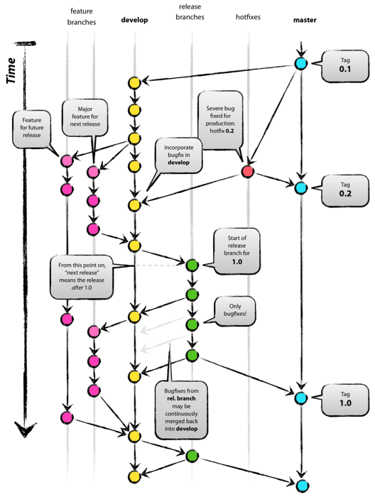

# Git Flow

## 특징
- 브랜치 전략에 있어서 다른 워크플로우보다 엄격하다.
- 계획적인 릴리즈를 스케줄링 하는 대규모 프로젝트에 적합하다.
- 대다수의 소프트웨어 개발 프로젝트에는 불필요한 절차를 준수하게 하여, 생산성을 떨어뜨린다는 비판이 있다.
## Branch
### Master
- 릴리즈 할 때 사용하는 최종 단계의 메인 브랜치이다.
- 릴리즈 기록을 담고 있다.
- 태그를 통해 Versioning을 하게 된다.
### Develop
- 다음 릴리즈 버전 개발을 진행하는 브랜치이다.
- 기능의 구현이 필요하면 Develop 브랜치에서 다시 브랜치를 내어 개발을 진행한다.
- 개발이 완료된 기능은 다시 Develop 브랜치로 병합된다.
### Feature
- 기능 구현을 이유로 브랜치를 낼 때 사용하는 브랜치이다.
- 브랜치를 내는 기준은 한 기능 단위가 된다.
### Release
- 현재 코드가 Master 브랜치로 병합될 수 있는지 테스트를 하고 테스트 과정에서 발생한 버그를 고치는 역할을 담당하는 브랜치이다.
### Hotfix
- 검수를 진행했음에도 릴리즈된 Master 브랜치에서 버그가 발생한 경우 사용하는 브랜치이다.
- 버그를 수정한 이후 Master 브랜치와 Develop 브랜치에 병합해주고 브랜치를 닫는다.

# GitHub Flow

## 특징
- Master 브랜치가 릴리즈에 있어서 절대적인 역할을 한다.
- Master 브랜치는 항상 최신 버전을 유지하며 Stable 한 상태를 담보한다.
- Develop 브랜치가 존재하지 않고 Feature 브랜치는 Master 브랜치에서 생성되며, 병합된다.
- 병합을 할 때는 무조건 Pull Request를 하여 코드에 대한 검토를 받도록 한다.
- Github flow는 CI가 필수적이다.

# GitLab Flow

## 특징
- 너무 단순해진 Github flow에 보완하는 내용을 가미하여 제안된 방식이다.
- Production 브랜치는 Git flow의 Master 브랜치 역할과 같다.
- Gitlab flow의 Master 브랜치는 Production 브랜치로 병합한다.
- Production 브랜치에서 릴리즈된 코드가 항상 프로젝트 최신버전 상태를 유지해야 할 필요가 없다는 이점이 있다.