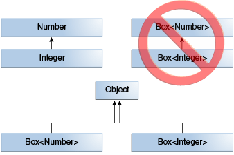

# Generic이란?
- 클래스, 인터페이스 및 메서드를 정의할 때 유형이 매개변수가 되도록 한다.
- 코드 내부에서 사용할 자료형을 외부에서 지정하는 기법이다.

# 사용의 이점
- 컴파일 시, 강력한 타입 검사를 통해 런타임 오류를 방지한다.
- 캐스팅을 제거하여 불필요한 코드를 줄인다.
```java
// The following code snippet without generics requires casting.
List list = new ArrayList();
list.add("hello");
String s = (String) list.get(0);
// When re-written to use generics, the code does not require casting.
List<String> list = new ArrayList<String>();
list.add("hello");
String s = list.get(0);   // no cast
```
- 다양한 유형의 컬렉션에서 작업할 수 있고, 커스터마이징 가능하며, 안전한 타입, 가독성 좋은 제네릭 알고리즘을 구현할 수 있다.

# 종류
## Parameterized Type
- 타입 매개 변수(K, V)를 매개 변수화 타입(List<String>)으로 대체할 수 있다.
```java
OrderedPair<String, Box<Integer>> p = new OrderedPair<>("primes", new Box<Integer>(...));
```

## Generic Method
- 제네릭 메서드는 자체 타입 매개 변수를 도입하는 메서드이다.
- 제네릭 타입을 선언하는 것 과 비슷하지만 타입 매개 변수의 범위는 메서드로 제한된다.
```java
public class Pair<K, V> {
  private K key;
  private V value;
  public Pair(K key, V value) {
    this.key = key;
    this.value = value;
  }
  public void setKey(K key) { this.key = key; }
  public void setValue(V value) { this.value = value; }
  public K getKey()   { return key; }
  public V getValue() { return value; }
}
public class Util {
  public static <K, V> boolean compare(Pair<K, V> p1, Pair<K, V> p2) {
    return p1.getKey().equals(p2.getKey()) && p1.getValue().equals(p2.getValue());
  }    
}
```
```java
public class Main {
	public static void main(String[] args) {
		// The complete syntax for invoking this method would be.
		Pair<Integer, String> p1 = new Pair<>(1, "apple");
		Pair<Integer, String> p2 = new Pair<>(2, "pear");
		boolean same = Util.<Integer, String>compare(p1, p2);
		// The type has been explicitly provided, as shown in bold. Generally, this can be left out and the compiler will infer the type that is needed.
		same = Util.compare(p1, p2);
	}
}
```

## Bounded Type Parameter
- 매개 변수화 타입의 타입 인수로 사용할 수 있는 타입을 제한할 수 있다.
```java
public class Box<T> {
  ...
  public <U extends Number> void inspect(U u) { // The parameter u is only allowed in classes that inherit Number.
    System.out.println("T: " + t.getClass().getName());
    System.out.println("U: " + u.getClass().getName());
  }
}
public class Main {
	public static void main(String[] args) {
		Box<Integer> integerBox = new Box<Integer>();
		integerBox.set(new Integer(10));
		integerBox.inspect("some text"); // error: this is still String!
	}
}
```
- 바인딩된 타입 매개 변수는 제네릭 알고리즘 구현의 핵심이다.
```java
public class Main {
  // The greater than operator (>) applies only to primitive types such as short, int, double, long, float, byte, and char.
  public static <T> int countGreaterThan(T[] anArray, T elem) {
    int count = 0;
    for (T e : anArray) {
      if (e > elem) { // compiler error. 
        ++count;
      }
    }
    return count;
  }
  // To fix the problem, use a type parameter bounded by the Comparable<T> interface. This is recursive type bound.
  public static <T extends Comparable<T>> int countGreaterThan(T[] anArray, T elem) {
    int count = 0;
    for (T e : anArray) {
      if (e.compareTo(elem) > 0) {
        ++count;
      }
    }
    return count;
  }
}
```

## Generics, Inheritance, and Subtypes
- 타입이 호환되는 경우 한 타입의 객체를 다른 타입의 객체에 할당 할 수 있다.
```java
public class Main {
	public static void main(String[] args) {
		// Can assign an Integer to an Object, since Object is one of Integer's supertypes.
		Object someObject = new Object();
		Integer someInteger = new Integer(10);
		someObject = someInteger; // OK
		// Integer is also a kind of Number.
		someMethod(new Integer(10)); // OK
		someMethod(new Double(10.1)); // OK
		// any subsequent invocation of add will be allowed if the argument is compatible with Number.
		Box<Number> box = new Box<Number>();
		box.set(new Integer(10)); // OK
		box.set(new Double(10.1)); // OK
	}
	public static void someMethod(Number n) { /* ... */ }
}
```
- 두 개의 구체적인 유형 A와 B가 주어지면 MyClass\<A\>는 A와 B가 관련되어 있는지 여부에 관계없이 MyClass\<B\>와 관련이 없다. MyClass\<A\>와 MyClass\<B\>의 부모는 Object이다.  

- 클래스 또는 인터페이스를 확장하거나 구현하여 하위 유형을 지정할 수 있다.  

```java
// That associates an optional value of generic type P with each element.
public interface PayloadList<E, P> extends List<E> {
	void setPayload(int index, P val);
}
```
* PayloadList는 List\<String\>의 서브타입으로 아래의 형태를 가질 수 있다.

  * PayloadList\<String, String\>
  * PayloadList\<String, Integer\>
  * PayloadList\<String, Exception\>

## Upper Bounded Wildcards
- 변수에 대한 제한을 완화할 수 있다.
```java
public class Main {
	public static void main(String[] args) {
		// Using a list of Integer objects, prints sum = 6.0.
		List<Integer> li = Arrays.asList(1, 2, 3);
		System.out.println("sum = " + sumOfList(li));
		// A list of Double values can use the same sumOfList method. The following code prints sum = 7.0.
		List<Double> ld = Arrays.asList(1.2, 2.3, 3.5);
		System.out.println("sum = " + sumOfList(ld));
	}
	public static void process(List<? extends Foo> list) {
    for (Foo elem : list) {
      // ...
    }
	}
	public static double sumOfList(List<? extends Number> list) {
    double s = 0.0;
    for (Number n : list) {
      s += n.doubleValue();
    }
    return s;
	}
}
```

## Unbounded Wildcard Type
- 와일드카드 문자열 \'?\'를 사용하여 변수에 대한 제한을 하지 않을 수 있다.
```java
public class Main {
	public static void main(String[] args) {
    // Because for any concrete type A, List<A> is a subtype of List<?>, you can use printList to print a list of any type.
		List<Integer> li = Arrays.asList(1, 2, 3);
		List<String>  ls = Arrays.asList("one", "two", "three");
		printList(li);
		printList(ls);
	}
	public static void printList(List<?> list) {
    for (Object elem: list) {
      System.out.print(elem + " ");
    }
    System.out.println();
	}
}
```

## Lower Bounded Wildcards
- super 키워드 다음에 와일드카드 문자열 \'?\'와 lower bound를 표기하는 \<? super A\>를 사용하여 해당 타입과 상위 타입으로 제한 할 수 있다.
```java
public class Main {
	public static void main(String[] args) {
		addNumbers(new ArrayList<Number>());
	}
	public static void addNumbers(List<? super Integer> list) {
    for (int i = 1; i <= 10; i++) {
      list.add(i);
    }
	}
}
```

## Wildcard And Subtyping
- 와일드 카드를 사용하여 제네릭 클래스 또는 인터페이스 간의 관계를 만들 수 있다.
```java
public class Main {
	public static void main(String[] args) {
		// It would be reasonable to write the following code.
		B b = new B();
		A a = b;
		// Class B is a subtype of class A if B extends A. This rule does not apply to generic types.
		List<B> lb = new ArrayList<>();
		List<A> la = lb; // compile-time error
	}
}
```
- Integer가 Number의 하위 타입이지만 List\<Number\>와 List\<Integer\>.의 공통 부모는 List<?>이다.  

- List의 제네릭 타입을 상위 타입인 Number와 하위 타입인 Integer를 사용 한 예제이다.
```java
public class Main {
	public static void main(String[] args) {
		...
		// In order to create a relationship between these classes so that the code can access Number's methods through List<Integer>'s elements, use an upper bounded wildcard:.
		List<? extends Integer> intList = new ArrayList<>();
		List<? extends Number>  numList = intList; // OK. List<? extends Integer> is a subtype of List<? extends Number>
	}
}
```


## Wildcard Capture and Helper Methods
- 경우에 따라서 컴파일러는 코드(List<?>)에서 와일드카드 타입을 유추한다.
- 대부분 "capture of"라는 문구가 포함된 오류 메시지가 포함되어 표시가 된다.
- 해당 컴파일러 오류를 해결하기 Helper Method를 정의하여 해결할 수 있다.
```java
public class WildcardError {
	void foo(List<?> i) {
		i.set(0, i.get(0)); // The method set(int, capture#1-of ?) in the type List<capture#1-of ?> is not applicable for the arguments (int, capture#2-of ?)
	}
}
public class WildcardFixed {
	void foo(List<?> i) {
    fooHelper(i);
  }
  // Helper method created so that the wildcard can be captured
  // through type inference.
  private <T> void fooHelper(List<T> l) {
    l.set(0, l.get(0));
  }
}
```
- 더 복잡한 예제이다.
```java
public class WildcardErrorBad {
	public static void main(String[] args) {
		List <Integer> li = Arrays.asList (1, 2, 3);
		List <Double> ld = Arrays.asList (10.10, 20.20, 30.30);
		swapFirst(li, ld);

	}
	private static void swapFirst(List<? extends Number> l1, List<? extends Number> l2) {
		Number temp = l1.get(0);
		l1.set(0, l2.get(0)); // Expected a CAP#1 extends Number, got a CAP#2 extends Number. same bound, but different types.
		l2.set(0, temp); // Expected a CAP#1 extends Number, got a Number.
	}
}
```
```text
Exception in thread "main" java.lang.Error: Unresolved compilation problems: 
	The method set(int, capture#2-of ? extends Number) in the type List<capture#2-of ? extends Number> is not applicable for the arguments (int, capture#3-of ? extends Number)
	The method set(int, capture#4-of ? extends Number) in the type List<capture#4-of ? extends Number> is not applicable for the arguments (int, Number)

	at gracefulsoul.blog.generic.wildcard.capture.WildcardErrorBad.swapFirst(WildcardErrorBad.java:17)
	at gracefulsoul.blog.generic.wildcard.capture.WildcardErrorBad.main(WildcardErrorBad.java:11)
```

## Erasure of Generic Types
- Java 컴파일러는 모든 타입 매개 변수를 지우고 타입 매개 변수가 바운드 된 경우 첫 번쨰 바운드로 대체하고, 바운드 되지 않은 경우 Object로 바운드한다.
```java
public class Node<T> {
	private T data;
	private Node<T> next;
	public Node(T data, Node<T> next) {
		this.data = data;
		this.next = next;
	}
	public T getData() { return data; }
	// ...
}
// Because the type parameter T is unbounded, the Java compiler replaces it with Object
public class Node {
	private Object data;
	private Node next;
	public Node(Object data, Node next) {
		this.data = data;
		this.next = next;
	}
	public Object getData() { return data; }
	// ...
}
```
```java
public class ComparableNode<T extends Comparable<T>> {
	private T data;
	private ComparableNode<T> next;
	public ComparableNode(T data, ComparableNode<T> next) {
		this.data = data;
		this.next = next;
	}
	public T getData() { return data; }
	// ...
}
// The Java compiler replaces the bounded type parameter T with the first bound class, Comparable.
public class ComparableNode {
	private Comparable data;
	private ComparableNode next;
	public ComparableNode(Comparable data, ComparableNode next) {
		this.data = data;
		this.next = next;
	}
	public Comparable getData() { return data; }
	// ...
}
```

## Erasure of Generic Methods
- Java 컴파일러는 제네릭 메소드 인수의 타입 매개 변수도 지운다.
```java
  // Counts the number of occurrences of elem in anArray.
	public static <T> int count(T[] anArray, T elem) {
	    int cnt = 0;
	    for (T e : anArray) {
	        if (e.equals(elem)) {
	            ++cnt;
	        }
	        return cnt;
	    }
	}
	// Because T is unbounded, the Java compiler replaces it with Object.
	public static int count(Object[] anArray, Object elem) {
	    int cnt = 0;
	    for (Object e : anArray) {
	        if (e.equals(elem)) {
	            ++cnt;
	        }
	        return cnt;
	    }
	}
```
```java
class Shape {
  public static <T extends Shape> void draw(T shape) { /* ... */ }
}
//The Java compiler replaces T with Shape.
class Shape {
  public static void draw(Shape shape) { /* ... */ }
}
```

## Bridge Methods
- 매개 변수화 된 클래스와 인터페이스를 확장 및 구현하는 클래스 또는 인터페이스를 컴파일 할 때, 컴파일러는 Bridge Method라는 합성 메서드를 만들수도 있다.
```java
public class Node {
	public Object data;
	public Node(Object data) { this.data = data; }
	public void setData(Object data) {
		System.out.println("Node.setData");
		this.data = data;
	}
}
public class MyNode extends Node {
	public MyNode(Integer data) {
		super(data);
	}
	public void setData(Integer data) {
		System.out.println("MyNode.setData");
		super.setData(data);
	}
}
public class MyNode extends Node {
	...
	// Bridge method generated by the compiler.
	public void setData(Object data) {
		setData((Integer) data);
	}
}
```
## Non-Reifiable Types
- 수정 가능한 타입은 타입의 정보를 런타임시에 이용할 수 있는 타입이다.
- 수정 불가능한 타입은 Type Erasure로 컴파일 시 정보가 삭제된 타입으로, 런타임에 모든 정보를 사용 할 수 없다.

### Heap Pollution
- 매개 변수화 된 타입이 매개 변수화 된 타입이 아닌 객체를 참조 할 떄 발생한다.
- 예를 들어, 원시 타입과 매개 변수화 된 타입을 혼합하거나 확인되지 않은 캐스트를 수행할 때 발생한다.

### Potential Vulnerabilities of Varargs Methods with Non-Reifiable Formal Parameters
- Varargs 입력 매개 변수를 사용하는 제네릭 메서드는 힙 오염을 일으킬 수 있다.
```java
public class ArrayBuilder {
	public static <T> void addToList(List<T> listArg, T... elements) {
		for (T x : elements) {
			listArg.add(x);
		}
	}
	public static void faultyMethod(List<String>... l) {
		Object[] objectArray = l; // Valid
		objectArray[0] = Arrays.asList(42);
		String s = l[0].get(0); // ClassCastException thrown here
	}
}
public class HeapPollutionExample {
	public static void main(String[] args) {
		List<String> stringListA = new ArrayList<String>();
		List<String> stringListB = new ArrayList<String>();
		ArrayBuilder.addToList(stringListA, "Seven", "Eight", "Nine");
		ArrayBuilder.addToList(stringListB, "Ten", "Eleven", "Twelve");
		List<List<String>> listOfStringLists = new ArrayList<List<String>>();
		// Type safety: A generic array of List<String> is created for a varargs parameter.
		ArrayBuilder.addToList(listOfStringLists, stringListA, stringListB);
		ArrayBuilder.faultyMethod(Arrays.asList("Hello!"), Arrays.asList("World!"));
	}
}
```

### Prevent Warnings from Varargs Methods with Non-Reifiable Formal Parameters
- 매개 변수화 타입의 매개 변수를 가지는 varargs 메서드에 아래의 어노테이션을 사용함으로써, 컴파일러가 생성하는 ClassCastException 혹은 이와 유사한 다른 Exception들을 방지할 수 있다.
  * @SafeVarargs[^SafeVarargs]
    - 메서드의 구현이 varargs 공식 매개변수를 부적절하게 처리 하지 않을 것을 주장한다.
  * @SuppressWarnings({"unchecked", "varargs"})[^SuppressWarnings]
    - 이 어노테이션은 메서드의 호출 사이트에서 생성된 경고를 억제하지 않는다.

# Reference
[^SafeVarargs]: [Oracle-Java_Docs_SafeVarargs](https://docs.oracle.com/javase/8/docs/api/java/lang/SafeVarargs.html)
[^SuppressWarnings]: [Oracle-Java_Docs_SuppressWarnings](https://docs.oracle.com/javase/8/docs/api/java/lang/SuppressWarnings.html)

※ 본 글은 [Oracle-Java_Tutorial_Generic](https://docs.oracle.com/javase/tutorial/java/generics/types.html)을 기반으로 작성하였습니다.  
※ Sample Code는 [여기](https://github.com/GracefulSoul/Sample/tree/master/src/main/java/gracefulsoul/blog/generic)에서 확인 가능합니다.