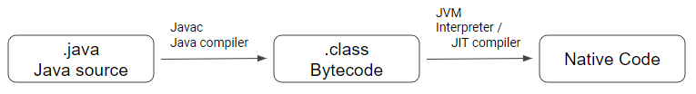

# Java란?
- 제임스 고슬링(James Gosling)과 다른 연구원들이 개발한 객체 지향적인 프로그래밍 언어이다.

# Java의 특징
- 객체 지향 프로그래밍(Object-Oriented Programming) 언어[^OOP]이다.
  * JDK8 이후의 Lambda Expression은 함수형 프로그래밍[^FP]을 지원한다.
- 컴파일 언어인 동시에 인터프리터[^Interpreter] 언어이다.  

  * Javac(Java Compiler)를 이용하여 JVM이 이해할 수 있는 16진수의 Java bytecode로 변환한다.
  * 컴파일된 Java bytecode를 JVM(Java Virtual Machine)[^JVM]에서 Row 단위 수행의 경우 인터프리터를, 전체 수행의 경우 JIT(Just-In Time) Compiler[^JIT]를 이용하여 기계어로 변환하여 실행한다.
- JVM에서 실행되므로 운영체제에 독립적이다.
- JVM을 사용하여 자동 메모리 관리(Garbage Collection)[^GarbageCollection]가 된다.
- 동적 로딩을 지원한다.
  * Load-Time dynamic loading : 클래스를 로딩하는 과정에서 클래스를 로딩한다.
    ```java
    public class RuntimeLoading {
      public static void main(String[] args) {
        System.out.println("Hello!");
      }
    }
    ```
  * Run-Time dynamic loading : 코드를 실행하는 순간에 클래스를 로딩한다.
    ```java
    public enum Language {
      DEFAULT, KOREAN, ENGLISH;
    }
    public class KoreanGreeting implements Runnable {
      public void run() {
        System.out.println("안녕!");
      }
    }
    public class EnglishGreeting implements Runnable {
      public void run() {
        System.out.println("Hello!");
      }	
    }
    public class Greeting {
      public void greeting(Language language) {
        try {
          Class<?> _class = this.getClass(language);
          Runnable runnable = (Runnable)_class.newInstance();
          runnable.run();
        } catch (InstantiationException  |  IllegalAccessException e) {
          e.printStackTrace();
        }
      }
      private Class<?> getClass(Language language) {
        switch(language) {
          case KOREAN:
            return KoreanGreeting.class;
          default:
            return EnglishGreeting.class;
        }
      }
    }
    public class LoadTimeLoading {
      public static void main(String[] args) {
        Greeting greeting = new Greeting();
        greeting.greeting(Language.DEFAULT);
        greeting.greeting(Language.KOREAN);
      }
    }
    ```
- 네트워크와 분산처리를 지원한다.
  * 인터넷과 대규모 분산환경을 염두하여 다양한 네트워크 프로그래밍 라이브러리(Java API)를 통해 비교적 짧은 시간에 네트워킹 프로그래밍을 쉽게 개발할 수 있도록 지원한다.

# Support
JAVA 제품군의 지원은 아래의 도표[^Support]를 보면 알 수 있다.

| Release | GA Date | Premier Support Until | Extended Support Until | Sustaining Support
|:--------|:--------|:--------|:--------|:--------|
| 7 | July 2011 | July 2019 | July 2022\*\*\*\*\* | Indefinite |
| 8\*\* | March 2014 | March 2022 | December 2030 | Indefinite |
| 9 (non‑LTS) | September 2017 | March 2018 | Not Available | Indefinite |
| 10 (non‑LTS) | March 2018 | September 2018 | Not Available | Indefinite |
| 11 (LTS) | September 2018 | September 2023 | September 2026 | Indefinite |
| 12 (non‑LTS) | March 2019 | September 2019 | Not Available | Indefinite |
| 13 (non‑LTS) | September 2019 | March 2020 | Not Available | Indefinite |
| 14 (non‑LTS) | March 2020\*\*\* | September 2020 | Not Available | Indefinite |
| 15 (non‑LTS) | September 2020\*\*\* | March 2021 | Not Available | Indefinite |

# Reference
[^OOP]: [Blog-객체지향프로그래밍](../../paradigm/OOP)
[^FP]: [Blog-함수형프로그래밍](../../paradigm/FP)
[^Interpreter]: [Wiki-Interpreter](https://ko.wikipedia.org/wiki/%EC%9D%B8%ED%84%B0%ED%94%84%EB%A6%AC%ED%84%B0)
[^JIT]: [Wiki-JIT_Compiler](https://ko.wikipedia.org/wiki/JIT_%EC%BB%B4%ED%8C%8C%EC%9D%BC)
[^JVM]: [Wiki-JVM](https://ko.wikipedia.org/wiki/%EC%9E%90%EB%B0%94_%EA%B0%80%EC%83%81_%EB%A8%B8%EC%8B%A0)
[^GarbageCollection]: [NaverD2-Java_Garbage_Collection](https://d2.naver.com/helloworld/1329)
[^Support]: [Oracle-OracleJava_SE_Product_Releases](https://www.oracle.com/java/technologies/java-se-support-roadmap.html)