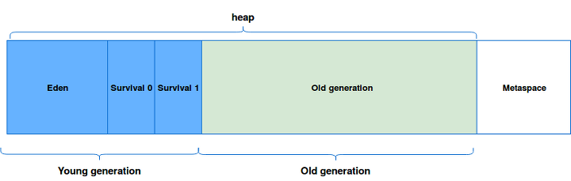
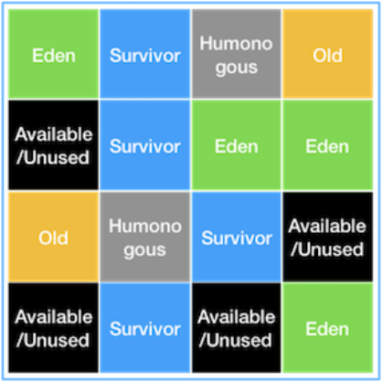
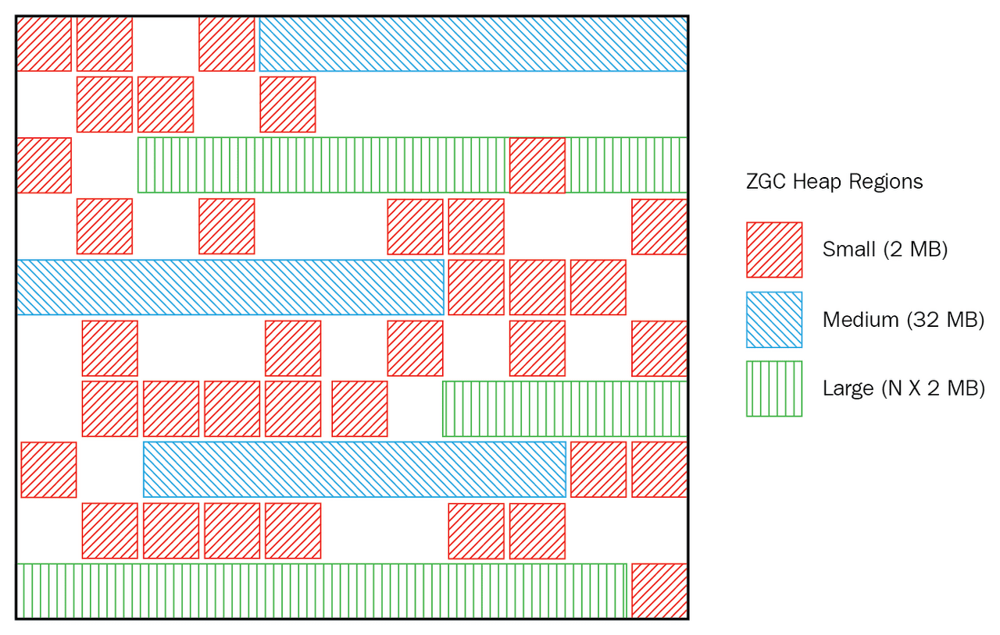

# Garbage Collection

- Java 프로그램이 자동 메모리 관리를 수행하는 프로세스이다.
- Java 프로그램은 Java Virtual Machine 또는 간단히 JVM에서 실행할 수있는 바이트 코드로 컴파일된다.
- Java 프로그램이 JVM에서 실행될 때 프로그램 전용 메모리의 일부인 힙에 개체가 생성된다.
- 결국 일부 개체는 더 이상 필요하지 않는다. 가비지 수집기는 이러한 사용하지 않는 개체를 찾아 삭제하여 메모리를 확보한다.

# 용어
## Stop-The-World(STW)
- GC을 실행하기 위해 JVM이 애플리케이션 실행을 멈추는 것이다.
- Stop-The-World가 발생하면 GC를 실행하는 스레드를 제외한 나머지 스레드들은 모두 작업을 멈추게된다.
## Metaspace
- JAVA 7에서 Heap Memory 영역 중 하나로 클래스 메타데이터를 저장하는 영역이었던 Permanent Generation이 JAVA 8에서 Metaspace로 대체되었다.
## Young Generation
- 새롭게 생성한 객체가 Heap Memory에서 위치하는 공간이다.
- Minor GC가 발생하면 Unreachable Object는 삭제되고, 지속적으로 참조되고 있는 객체들인 Surviving Object들은 Old Generation으로 이동한다.
# Old Generation
- 지속적으로 참조되고 있는 객체들이 Young 영역에서 살아남아 이동되는 공간이다.
- Old Generation이 가득차게되면 Major GC가 발생한다.
## Minor GC
- Young Generation에서 발생하는 GC이다.
## Major GC
- Old Generation에서 발생하는 GC이다.

# Process[^OracleGC]
1. 새로운 객체가 생성되면 Eden 영역에 할당이 된다.
2. Eden 영역이 가득차면 Minor GC가 발생하여, Reachable 오브젝트들은 Survival 0 영역으로 이동하고 Eden 영역은 정리된다.
3. 다음 Minor GC가 발생하면 2번 과정이 반복하고, Survival 0에 있는 Reachable 오브젝트들은 Survival 1으로 age 값이 증가하여 옮겨지고 Eden 영역과 Survival 0 영역이 정리된다.
4. 다음 Minor GC가 발생하면 3번 과정이 반복되고, Survival 1에서 살아남은 오브젝트들은 Survival 0로 이동하면서 Eden 영역과 Survival 1 영역이 정리된다.
5. 2 ~ 4번 과정이 지속적으로 반복되면서 Young Generation에서 계속 살아남아 age값이 특정 값 이상이 되면 Old Generation으로 이동한다. Promotion이라고 불리는 단계이다.
6. Minor GC가 계속 반복되면 Promotion이 꾸준히 발생하고, Old Generation이 가득차면 Major GC가 발생하게 된다. 이 때 Stop-The-World(STW)가 발생한다.

# 종류

## Serial GC
- Old 영역에서 Mark-Sweep-Compact라는 알고리즘을 사용한다.
  * Mark : Old 영역에 살아 있는 객체를 식별한다.
  * Sweep : 힙(heap)의 앞 부분부터 확인하여 살아 있는 것만 남긴다.
  * Compaction : 힙의 가장 앞 부분부터 채워서 객체가 존재하는 부분과 객체가 없는 부분으로 나눈다
- 적은 메모리와 CPU 코어 개수가 적을 경우 적합한 방식이다.
- -XX:+UseSerialGC JVM 옵션을 통해서 사용 가능하다.

## Parallel(Throughput) GC
- Serial GC와 동작 방식은 같지만, GC를 처리하는 쓰레드가 여러 개여서 Serial GC보다 빠르게 수행된다.
- 메모리가 충분하고 코어의 개수가 많을 때 유리하다.
- -XX:+UseParallelGC JVM 옵션을 통해서 사용 가능하다.

## Parallel Old GC
- Old 영역에서 Mark-Summary-Compaction이라는 알고리즘을 사용하여 Parallel GC와는 다르게 수행된다.
  * Summary : 앞서 GC를 수행한 영역에 대해서 별도로 살아있는 객체를 식별한다.
- -XX:+UseParallelOldGC JVM 옵션을 통해서 사용 가능하다.

## CMS(Low Latency) GC

- Serial, Parallel, Parallel Old GC와는 다른 방식으로 수행된다.
  * Initial Mark : 클래스 로더에서 가장 가까운 객체 중 살아 있는 객체만 찾아 멈추는 시간이 짧다.
  * Concurrent Mark : 다른 스레드가 실행 중인 상태에서 동시에 살아있다고 확인한 객체에서 참조하고 있는 객체들을 순차적으로 확인한다.
  * Remark : Concurrent Mark 단계에서 새로 추가되거나 참조가 끊긴 객체를 확인한다.
  * Concurrent Sweep : 다른 스레드가 실행되고 있는 상태에서 동시에 Garbage를 정리하는 작업을 실행한다.
- Stop-The-World 시간이 짧고, 다른 스레드가 실행되고 있는 상황에서 진행된다.
- 메모리와 CPU 사용이 더 많고, Compaction 단계가 제공되지 않는다.
- -XX:+UseConcMarkSweepGC JVM 옵션을 통해서 사용 가능하다.

## G1(Garbage First) GC[^G1GC]

- 전체 힙 메모리를 Region이라는 특정한 영역으로 나누어 역할(Eden, Survivor, Old)이 동적으로 부여되는 상태이다.
  * Initial Mark : 애플리케이션을 멈추고, Old Region에 존재하는 객체들이 참조하는 Survivor Region을 찾는다.
  * Root Region Scan : Initial Mark에서 찾은 Survivor 객체들에 대한 스캔을 한다.
  * Concurrent Mark : 전체 Heap Memory의 스캔을 하고, GC 대상 객체가 발견되지 않은 Region은 이후 단계에서 제외한다.
  * Remark : 애플리케이션을 멈추고, 최종적으로 GC 대상에서 제외할 객체를 식별한다
  * Cleanup : 애플리케이션을 멈추고, 살아있는 객체가 가장 적은 Region에 대한 미사용 객체를 제거한다
  * Copy : GC 대상의 Region이었지만, Cleanup 과정에서 완전히 비워지지 않은 Region의 살아남은 객체들을 새로운 Region(Available/Unused) Region에복사하여 Compaction을 수행한다. 살아있는 객체가 아주 적은 Old 영역에 대해 [GC pause(mixed)] 를 로그로 표시하고, Young GC가 이루어질 때 수집되도록 한다.
- 큰 힙 메모리에서 짧은 GC 시간을 보장한다.
- JAVA 9부터는 Default로 적용되며, -XX:+UseG1GC JVM 옵션을 통해서 사용 가능하다.

## ZGC

- JAVA 11에서 실험적 기능으로 추가된 확장 가능한 낮은 지연 가비지 수집기[^ZGC]이다.
- 일시 중지 시간은 10ms를 초과하지 않는다.
- 일시 중지 시간은 힙 또는 라이브 세트 크기에 따라 증가하지 않는다.
- 수백 메가 바이트에서 수 테라 바이트 크기의 힙을 처리한다.
- Linux/x64에서만 JVM 옵션(-XX:+UnlockExperimentalVMOptions, -XX:+UseZGC)을 추가하여 사용할 수 있다.
- 압축 된 oops, 압축 된 클래스 포인트 사용, 클래스 언로드는 지원하지 않으며, JVM 옵션을 추가하여도 효과가 없다.

## Shenandoah GC

- JAVA 12에서 추가된 Shenandoah[^Shenandoah]는 실행중인 Java 프로그램과 동시에 더 많은 Garbage Collection을 수행하여 Garbage Collector의 일시 중지 시간을 줄이는 Garbage Collector이다.
  * Init Mark : 동시 표시를 위해 Heap Memory 및 애플리케이션 스레드를 준비한 다음 <b>첫 번째 일시 중지</b>를 하여 Root Set를 스캔한다.
  * Concurrent Marking : Heap Memory 위에서 도달 가능한 객체를 추적한다.
  * Final Mark : 보류중인 모든 표시/업데이트 대기열을 비우고 <b>두 번째 일시 중지</b>를 하여 Root Set을 다시 검색하여 동시 표시를 완료한다.
  * Concurrent Cleanup : 즉시 Garbage 영역, 즉 동시 표시 이후에 감지 된 살아있는 객체가 없는 영역을 회수한다.
  * Concurrent Evacuation : 컬렉션 집합에서 다른 지역으로 개체를 복사하는 역할을 수행한다. 이는 다른 GC와는 차별적인 단계이다.
  * Init Update Refs : <b>세 번째 일시 중지</b>를 하여 업데이트 참조 단계를 초기화한다.
  * Concurrent Update References : 응용 프로그램과 동시에 실행되며, Heap Memory를 살펴보고 Concurrent Evacuation 중에 이동 된 객체에 대한 참조를 업데이트한다.
  * Final Update Refs :<b>마지막 일시 중지</b>를 통해 기존 Root Set를 다시 업데이트하여 업데이트 참조 단계를 완료한다.
  * Concurrent Cleanup : 참조가없는 컬렉션 집합 영역을 회수한다.
- 동시 압축을 포함하여 대량의 GC 작업을 동시에 수행하여 일시 중지 시간이 더 이상 힙 크기에 직접 비례하지 않는다.

# 도구
## VisualVM
- VisualVM[^VisualVM]은 애플리케이션 CPU 사용량, GC 활동, Heap 및 Metaspace / Permanent Generation Memory,로드된 클래스의 갯수 및 실행 중인 스레드들을 모니터링한다.
- Java 프로세스에서 실행중인 모든 스레드는 집계 된 Running, Sleeping, Wait, Park 및 Monitor 시간과 함께 타임 라인에 표시된다.
- 애플리케이션 성능 및 메모리 관리를 분석하기위한 기본 프로파일링 기능을 제공한다. 
- 대상 프로세스에서 진행되는 작업을 즉시 파악하기 위해 스레드 덤프를 가져와 표시하며, 여러 프로세스의 동시 스레드 덤프는 분산 된 교착 상태를 발견하는 데 도움이 된다.

## JConsole
- JConsole[^JConsole]은 그래픽 사용자 인터페이스는 JMX(Java Management Extensions) 사양을 준수하는 모니터링 도구이다.
- JConsole은 Java VM(Java Virtual Machine)의 광범위한 계측을 사용하여 Java 플랫폼에서 실행되는 응용 프로그램의 성능 및 리소스 소비에 대한 정보를 제공한다.

## Prometheus
- Prometheus[^Prometheus]의 Persistence Layer에는 key-value 형태의 NoSQL제품인 LevelDB를 사용하여 데이터를 저장된다.
- Grafana 대시보드를 지원하여 PromQL로 데이터를 시각화 하여 표현한다.
- Go/Java/Ruby/Python 등 10개 이상의 언어로 작성된 클라이언트 라이브러리를 사용 가능하다.
- 주로 Docker 모니터링 용도로 사용된다.

## Scouter
- Scouter[^Scouter]는 새로운 replicate 및 App dynamics와 같은 오픈 소스 APM이다.
- Agent, Sever(Collector), Client(Viewer), Web API(Since @1.8.0)의 4가지 모듈로 구성되어 실행이 된다.
- Scouter Client는 Eclipse RCP Platform으로 만들어진 독립 클라이언트이기 때문에, 웹형 뷰어보다 많은 성능 데이터를 제어할 수 있다.
- Scouter가 압축된 파일 서비스 성능 및 프로파일 데이터를 저장하여 빅데이터를 수집하고 각 서비스의 트랜잭션(요청)을 분석한다.

## Pinpoint
- Pinpoint[^Pinpoint]는 Java/PHP로 작성된 대규모 분산 시스템용 APM(Application Performance Management) 도구이다.
- 애플리케이션 토폴로지를 한눈에 이해할 수 있다.
- 실시간으로 애플리케이션 모니터링이 가능하다.
- 모든 트랜잭션에 대한 코드 수준의 가시성이 확보된다.
- 한 줄의 코드를 변경하지 않고 APM 에이전트를 설치할 수 있다.
- 성능에 미치는 영향 최소화(리소스 사용량 약 3% 증가)시키며 설치 및 실행이 가능하다.

# Reference
[^OracleGC]: [Oracle-Garbage_Collection](https://www.oracle.com/webfolder/technetwork/tutorials/obe/java/gc01/index.html)
[^G1GC]: [Oracle-G1_GC](https://www.oracle.com/technical-resources/articles/java/g1gc.html)
[^ZGC]: [OpenJDKWiki-ZGC](https://wiki.openjdk.java.net/display/zgc/Main)
[^Shenandoah]: [OpenJDKWiki-Shenandoah](https://wiki.openjdk.java.net/display/shenandoah/Main)
[^VisualVM]: [VisualVM-Home](https://visualvm.github.io/)
[^JConsole]: [OpenJDK-JConsole](http://openjdk.java.net/tools/svc/jconsole/)
[^Prometheus]: [Prometheus-Home](https://prometheus.io/)
[^Scouter]: [Github-Scouter](https://github.com/scouter-project/scouter)
[^Pinpoint]: [Pinpoint-Home](https://pinpoint-apm.github.io/pinpoint/)