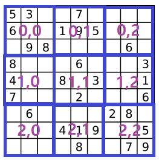

# 문제
[Link](https://leetcode.com/problems/valid-sudoku/){:target="_blank"}

# 코드
```java
class Solution {

  public boolean isValidSudoku(char[][] board) {
    Set<String> set = new HashSet<>();
    for (int i = 0; i < board.length; i++) {
      for (int j = 0; j < board[i].length; j++) {
        if (board[i][j] != '.') {
          if (!set.add(this.appendString(i, board[i][j])) ||
            !set.add(this.appendString(board[i][j], j)) ||
            !set.add(this.appendString(i / 3, j / 3, board[i][j]))) {
            return false;
          }
        }
      }
    }
    return true;
  }

  private String appendString(int... ints) {
    StringBuilder sb = new StringBuilder();
    for (int idx = 0; idx < ints.length; idx++) {
      sb.append(ints[idx]);
      if (idx < ints.length - 1) {
        sb.append(',');
      }
    }
    return sb.toString();
  }

}
```

# 결과
[Link](https://leetcode.com/submissions/detail/494387435/){:target="_blank"}

# 설명
1. 주어진 2차원 배열 board를 이용하여 스도쿠의 기본 틀로 사용이 가능한지를 검증하기 위해서는 아래의 기본 조건을 만족하여야 한다.
- 주어진 스도쿠의 크기는 $9 \times 9$의 크기로 숫자는 1 ~ 9 까지 존재한다.
- 각 가로열에는 1 ~ 9 까지의 숫자가 고유하게 들어가야 한다.
- 각 세로열에는 1 ~ 9 까지의 숫자가 고유하게 들어가야 한다.
- $3 \times 3$ 크기로 나눈 9개의 정육면체 배열에 1 ~ 9 까지 숫자가 고유하게 들어가야 한다.

2. 고유 값이 들어가는 조건을 검증하기 위해 Set을 정의하였다.
- Set은 중복이 배제된 Collection으로, add(E e) 메서드는 e의 값이 중복되어 들어있는지 여부의 boolean 값을 반환한다.
- 그렇기 때문에 각 조건에 대한 값들을 누적해서 저장하다보면, 중복된 값이 있는지를 파악할 수 있다.

3. 모든 배열의 내용을 반복하여 위의 경우에 중복된 값이 존재하는지를 검증한다.

4. '.'이 아닌 숫자인 경우, 1번의 세 조건을 set에 String으로 저장하였다.
- 각 숫자 문자열의 Ascii code 10진수 값은 48(0) ~ 57(9) 이므로, 중복된 값을 저장하기 위해선 임의의 Format을 정의하여 값을 누적시키면 된다.
- 가로열 검증에는 i, board[i][j] 형태로 문자열을 정의하였다.
- 세로열 검증에는 board[i][j], j 형태로 문자열을 정의하였다.
- $3 \times 3$ 크기의 정육면체 검증에는 $\frac{i}{3}$, board[i][j], $\frac{j}{3}$ 형태로 문자열을 정의하였다.
- $3 \times 3$ 크기의 정육면체 검증에 쓰인 i와 j에 3을 나눠준 이유는 각 정육면체를 분류하기 위해서이다. (자세한건 아래에 그림으로 그렸다.)

- 동적 문자열의 생성시, 효율적인 메모리 사용을 위해 [StringBuilder](https://docs.oracle.com/javase/tutorial/java/data/buffers.html){:target="_blank"}를 사용한다.

6. 만일 중복된 값이 있으면(add 메서드가 false를 반환하면) 주어진 문제의 결과로 false를 반환한다.

7. 반복문이 끝난 경우 주어진 문제의 스도쿠 배열인 board가 정상이라는 의미이므로, 주어진 문제의 결과로 true를 반환한다.

# 소스
Sample Code는 [여기](https://github.com/GracefulSoul/leetcode/blob/master/src/main/java/gracefulsoul/problems/ValidSudoku.java){:target="_blank"}에서 확인 가능합니다.