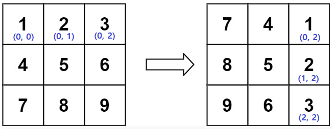

# 문제
[Link](https://leetcode.com/problems/rotate-image/){:target="_blank"}

# 코드
```java
class Solution {

  public void rotate(int[][] matrix) {
    boolean[][] fixed = new boolean[matrix.length][matrix.length];
    for (int i = 0; i < matrix.length; i++) {
      for (int j = 0; j < matrix.length; j++) {
        if (!fixed[i][j]) {
          int temp = matrix[i][j];
          matrix[i][j] = matrix[j][matrix.length - 1 - i];
          matrix[j][matrix.length - 1 - i] = temp;
          fixed[j][matrix.length - 1 - i] = true;
        }
      }
    }
  }

}
```

# 결과
[Link](https://leetcode.com/submissions/detail/500297400/){:target="_blank"}

# 설명
1. 간단히 2차원 배열을 90도 회전하는 문제이다.

2. 주어진 배열 matrix를 이용하여 동일 크기인 2차원 fixed를 만든다.
- 어떠한 값이 기존 배열의 위치에서 90도 회전된 위치에 값을 주입하면, 반복문이 수행될 때 해당 위치에 도달 할 수 있으므로 해당 배열의 위치가 90도 회전되어 저장되었다는 표시를 남기기 위해 사용한다.

3. 문제의 반환 값은 없으며, 주어진 배열 matrix를 회전시키면 되므로 반복문을 통해서 모든 요소를 90도 회전한다.
- 2차원 배열은 2중 반복문으로 호출하되, fixed[i][j]값이 false인 경우만 90도 회전시킨다.
- 기존 값을 90도 회전시키기 위해서는 matrix[i][j]의 값을 matrix[j]\[$matrix.length - 1 -i$\]의 자리에 위치시켜야 한다.
  - [0, 0] -> [2, 0], [0, 1] -> [2, 1], [0, 2] -> [2, 2]
  - 

# 소스
Sample Code는 [여기](https://github.com/GracefulSoul/leetcode/blob/master/src/main/java/gracefulsoul/problems/RotateImage.java){:target="_blank"}에서 확인 가능합니다.