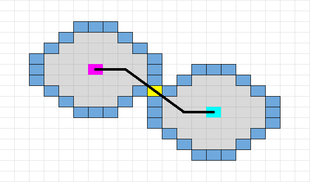

# 문제
[Link](https://leetcode.com/problems/open-the-lock){:target="_blank"}

# 코드
```java
class Solution {

  public int openLock(String[] deadends, String target) {
    Set<String> start = new HashSet<>();
    start.add("0000");
    Set<String> end = new HashSet<>();
    end.add(target);
    Set<String> checked = new HashSet<>(Arrays.asList(deadends));
    int step = 0;
    while (!start.isEmpty() && !end.isEmpty()) {
      Set<String> temp = new HashSet<>();
      for (String curr : start) {
        if (end.contains(curr)) {
          return step;
        } else if (checked.contains(curr)) {
          continue;
        } else {
          checked.add(curr);
          temp.addAll(this.getNexts(curr));
        }
      }
      step++;
      start = end;
      end = temp;
    }
    return -1;
  }

  private List<String> getNexts(String lock) {
    List<String> locks = new ArrayList<>();
    char[] charArray = lock.toCharArray();
    for (int idx = 0; idx < charArray.length; idx++) {
      char c = charArray[idx];
      charArray[idx] = c == '9' ? '0' : (char) (c + 1);
      locks.add(String.valueOf(charArray));
      charArray[idx] = c == '0' ? '9' : (char) (c - 1);
      locks.add(String.valueOf(charArray));
      charArray[idx] = c;
    }
    return locks;
  }

}
```

# 결과
[Link](https://leetcode.com/problems/open-the-lock/submissions/855412378/){:target="_blank"}

# 설명
1. 0 ~ 9 까지로 이루어져 있는 원형 자물쇠의 잠금을 해제하기 위해 휠을 돌리는 최소 횟수를 구하는 문제이다.
- 단, 해제가 불가능한 경우 -1을 반환한다.
- 잠금은 초기 상태인 '0000'에서 시작한다.
- 잠금의 해제 도중 deadends에 포함된 번호에 도달하면 잠금 해제가 불가능한 경우로 취급한다.

2. 문제 풀이에 필요한 변수를 정의한다.
- start는 자물쇠 잠금 해제 시 시작할 번호를 저장할 변수로, 초기 값인 "0000"을 넣은 HashSet으로 초기화한다.
- end는 자물쇠 잠금 해제 시 종료될 번호를 저장할 변수로, 비밀번호인 target을 넣은 HashSet으로 초기화한다.
- checked는 이미 확인한 번호를 저장할 변수로, 사용 불가 번호인 deadends를 넣은 HashSet으로 초기화한다.
- step은 최소 이동 횟수를 저장할 변수로, 0으로 초기화한다.

3. start와 end가 비어있지 않을 때 까지 아래를 반복한다.
- 임시 번호를 저장할 temp를 HashSet으로 초기화한다.
- start의 모든 값을 순차적으로 curr에 넣어 아래를 수행한다.
  - curr의 값이 end에 포함되는 경우 종료 위치에 도달했으므로, step을 주어진 문제의 결과로 반환한다.
  - 위의 경우가 아니면서 curr의 값이 checked에 포함되는 경우 무시해야하므로, 다음 반복을 수행한다.
  - 그 외의 경우, checked에 curr을 넣고 4번에서 정의한 getNexts(String lock) 메서드를 이용하여 다음에 검증할 번호들을 temp에 모두 넣고 반복을 계속 수행한다.
- 반복이 완료되면 수행이 완료되었으므로 아래를 수행하고 반복을 계속 수행한다.
  - 한 순서를 사용했으므로, 휠을 돌리는 최소 횟수인 step을 증가시킨다.
  - start를 end로 바꾸어주고, end를 temp로 바꾸어준다.

4. 현재 번호에서 탐색하기 위해 다음 번호들을 생성하는 getNexts(String lock) 메서드를 정의한다.
- 수행을 위한 변수를 정의한다.
  - locks는 다음 번호들을 저장할 변수로, ArrayList로 초기화한다.
  - charArray는 현재 번호인 lock을 문자 배열로 저장한 변수이다.
- 0부터 charArray의 길이 미만까지 idx를 증가시키며 아래를 반복한다.
  - c에 charArray의 idx번째 문자를 넣어준다.
  - c가 '9'인 경우 '0'으로 바꾸어주고, 그렇지 않으면 다음 번호로 증가시켜 charArray의 idx번째 위치에 넣어준 후 locks에 charArray를 문자열로 변환하여 저장한다.
  - 위와 동일하게 c가 '0'인 경우 '9'로 바꾸어주고, 그렇지 않으면 아래 번호로 감소시켜 charArray의 idx번째 위치에 넣어준 후 locks에 charArray를 문자열로 변환하여 저장한다.
  - charArray의 idx번째 문자에 c를 넣어 원복시켜준다.
- 반복이 완료되면 다음 번호들이 저장된 locks를 반환한다.

# 해설
- 3번의 반복의 마지막에서 "start를 end로 바꾸어주고, end를 temp로 바꾸어준다."의 의미는 2-end BFS를 수행하는 것이다.
- 2-end BFS란 아래의 사진을 보면서 설명하겠다.

- 보라색 지점에서 녹청색 지점으로 가기 위해서 최단 경로를 탐색하기 위해서 각 지점에서 BFS를 수행한다.
- 각 포인트에서 BFS를 수행하다보면 최소 경로가 되기 위한 노란색 접점이 발생하게 되며, 이 부분이 최단 경로가 되기 위한 지점이 된다.
- 이는 3번의 반복에서 "curr의 값이 end에 포함되는 경우 종료 위치에 도달"의 내용과 같이, 두 외각 지점의 접점이 존재하는 경우이므로 해당 횟수가 최소 횟수가 되는 것이다.

# 소스
Sample Code는 [여기](https://github.com/GracefulSoul/leetcode/blob/master/src/main/java/gracefulsoul/problems/OpenTheLock.java){:target="_blank"}에서 확인 가능합니다.