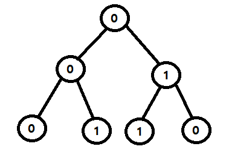

# 문제
[Link](https://leetcode.com/problems/k-th-symbol-in-grammar){:target="_blank"}

# 코드
```java
class Solution {

  public int kthGrammar(int n, int k) {
    if (n == 1) {
      return 0;
    } else if (k % 2 == 0) {
      return 1 - this.kthGrammar(n - 1, k / 2);
    } else {
      return this.kthGrammar(n - 1, (k + 1) / 2);
    }
  }

}
```

# 결과
[Link](https://leetcode.com/problems/k-th-symbol-in-grammar/submissions/864042701/){:target="_blank"}

# 설명
1. 1-indexed의 n개의 행으로 이루어진 테이블에서 k번째 값을 반환하는 문제이다.
- 이전 행에서 0을 01로, 1을 10으로 변경해서 다음 행을 구성한다.
- 예를 들어 n이 3인 경우 테이블은 아래의 사진과 동일한 트리 형태인 테이블로 구성된다.  


2. 아래의 각 경우에 따라 값을 반환한다.
- n이 1인 경우, 처음 값은 무조건 0이므로 0을 반환한다.
- k가 짝수인 경우, 1에서 $n - 1$과 $\frac{k}{2}$를 이용하여 재귀 호출 한 값을 빼서 반환한다.
- k가 홀수인 경우, $n - 1$과 $\frac{k + 1}{2}$를 이용하여 재귀 호출 한 값을 반환한다.

# 해설
- F($n - 1$)을 사용해서 F(n)의 값을 탐색하는 방식이다.
- 즉, 짝수 인덱스의 경우 값을 재귀 호출의 값을 반전시킨 값을 통해 지속 탐색한 결과가 해당 위치의 값이 된다.
  - 0과 1의 경우, 1에서 빼면 값은 반전된다.
- 홀수 인덱스의 경우 재귀 호출을 통해 지속 탐색된 결과가 해당 위치의 값이 된다.

# 소스
Sample Code는 [여기](https://github.com/GracefulSoul/leetcode/blob/master/src/main/java/gracefulsoul/problems/KthSymbolInGrammar.java){:target="_blank"}에서 확인 가능합니다.