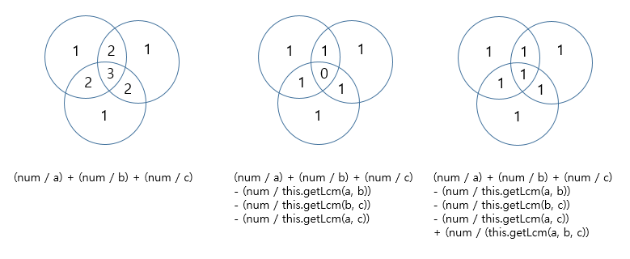

# 문제
[Link](https://leetcode.com/problems/ugly-number-iii/){:target="_blank"}

# 코드
```java
class Solution {

  public int nthUglyNumber(int n, int a, int b, int c) {
    int left = 0;
    int right = (int) 2e9;
    int result = 0;
    while (left <= right) {
      int mid = left + (right - left) / 2;
      if (this.getCount(mid, a, b, c) >= n) {
        result = mid;
        right = mid - 1;
      } else {
        left = mid + 1;
      }
    }
    return result;
  }

  private int getCount(long num, long a, long b, long c) {
    long bc = this.getLcm(b, c);
    return (int) ((num / a) + (num / b) + (num / c)
        - (num / this.getLcm(a, b)) - (num / bc) - (num / this.getLcm(a, c))
        + (num / (this.getLcm(a, bc))));
  }

  private long getGcd(long m, long n) {
    if (n == 0) {
      return m;
    } else {
      return this.getGcd(n, m % n);
    }
  }

  private long getLcm(long a, long b) {
    return (a * b) / this.getGcd(a, b);
  }

}
```

# 결과
[Link](https://leetcode.com/problems/minimum-absolute-difference/submissions/1405526087/){:target="_blank"}

# 설명
1. a, b, c의 n번째 못생긴 숫자를 구하는 문제이다.
- 못생긴 숫자는 a, b 또는 c로 나눌 수 있는 양의 정수를 의미한다.

2. 문제 풀이에 필요한 변수를 정의한다.
- left와 right는 가능한 숫자의 범위로, 0과 상한값인 $2 \times 10^9$로 초기화한다.
- result는 결과를 저장할 변수로, 0으로 초기화한다.

3. left가 right 이하일 때 까지 아래를 반복여 이진 탐색을 수행한다.
- mid는 중앙값을 저장할 변수로, $left + \frac{right - left}{2}$의 값을 넣어준다.
- 4번에서 정의한 getCount(long num, long a, long b, long c)의 결과에 따라 아래를 수행한다.
  - 결과가 참인 경우, result에 mid를 넣은 후 right에 $mid - 1$을 넣어 상한값을 낮춰준다.
  - 결과가 거짓인 경우, left에 $mid + 1$을 넣어 하한값을 증가시켜준다.

4. 배수의 갯수를 찾을 getCount(long num, long a, long b, long c) 메서드를 정의한다.
- 아래의 값들을 모두 계산하여 a와 b, c를 나눈 숫자의 갯수를 모두 만족하는 결과를 계산하여 반환한다.
  - num을 a와 b, c로 각각 나눈 값을 모두 더한다.
  - num을 a와 b, b와 c, a와 c의 최소 공배수로 각각 나눈 값을 뺴준다.
  - num을 a와 b, c의 최소 공배수로 나눈 결과를 다시 더해준다.

5. 반복이 완료되면 n번째 못생긴 숫자가 저장된 result를 주어진 문제의 결과로 반환한다.

# 해설

1. 왼쪽 그림과 같이 a, b, c로 나눌 수 있는 영역을 모두 더한 경우에 겹치는 부분이 존재한다.
2. 그렇기 때문에 가운데 그림과 같이 a와 b, b와 c, a와 c에 대한 최소 공배수에 대한 결과를 제거하면 공통 부분이 제거된다.
3. 마지막으로 a, b, c의 최소 공배수에 대한 결과를 더하면 모든 값에 대해서 중복을 제거한 값들의 갯수를 구할 수 있다.

# 소스
Sample Code는 [여기](https://github.com/GracefulSoul/leetcode/blob/master/src/main/java/gracefulsoul/problems/MinimumAbsoluteDifference.java){:target="_blank"}에서 확인 가능합니다.