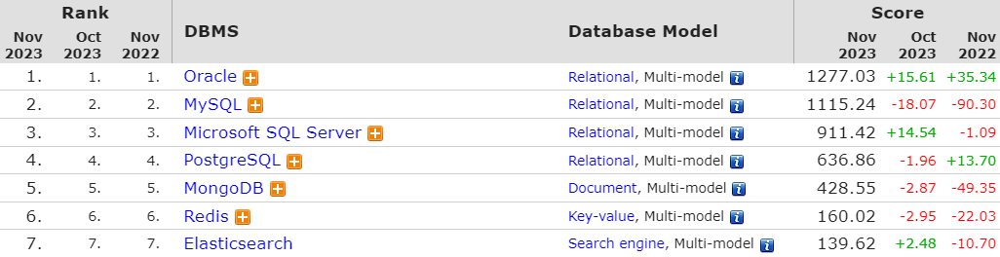
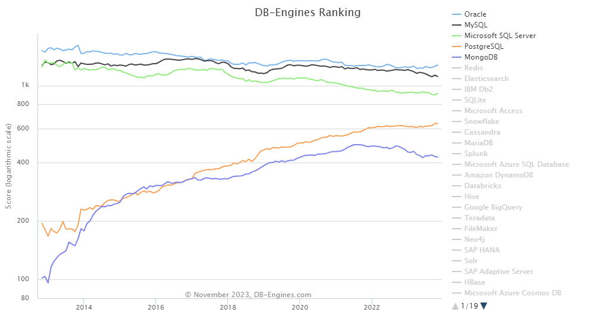

# PostgreSQL[^PostgreSQL]
- PostgreSQL은 대중적으로 MySQL과 동시에 많이 사용하는 확장 가능 및 표준 준수를 강조하는 Open Source ORDMBS로, 다양한 기능들을 제공하며 여러 나라의 개발자들의 자발적인 노력으로 꾸준히 발전하고 있다.
- 캘리포니아 대학교 버클리 캠퍼스의 POSTGRES 프로젝트로 시작한 PostgreSQL은 1986년부터 35년이 넘는 시간동안 꾸준히 발전해왔으며, 현재도 3개월 단위의 릴리즈가 2024년 8월까지 확정되어있다.
- 잡설로, PostgreSQL의 로고인 'Slonik'이라는 이름의 코끼리는 아가사 크리스티의 소설 '코끼리는 기억한다'에서 착안해 제안했다는 이야기도 있다.

# Why use it?
- 오픈 소스이기 때문에 개발 및 운영에 대한 <b>비용 절감</b>을 추구할 수 있으며, 다양한 시스템들간 <b>유연한 연동</b>이 가능하다.
- <b>활성화된 커뮤니티</b>는 다양한 소속의 개발자들과의 소통을 통해 기능 확장을 통한 <b>시스템 확장성</b>을 확보하며 문제점 해결과 기능 보완을 통한 <b>견고한 안정성</b>을 확보 할 수 있다.

# Popularity
- [DB-Engines](https://db-engines.com/){:target="_blank"}에서 제공하는 시스템 인지도와 관련된 순위는 아래와 같다.

- 위에서 동일하게 제공하는 시계열 추이 그래프로, 상위 5개의 DBMS를 살펴보았다.

- 위에서 보듯이 PostgreSQL은 꾸준한 관심과 인지도가 상승하는 것을 확인할 수 있으며, 이를 통한 시스템의 발전을 기대할 수 있는 것이다.

# Inexhaustive list
- Data Types
  - Primitives: Integer, Numeric, String, Boolean
  - Structured: Date/Time, Array, Range / Multirange, UUID
  - Document: JSON/JSONB, XML, Key-value (Hstore)
  - Geometry: Point, Line, Circle, Polygon
  - Customizations: Composite, Custom Types
- Data Integrity
  - UNIQUE, NOT NULL
  - Primary Keys
  - Foreign Keys
  - Exclusion Constraints
  - Explicit Locks, Advisory Locks
- Concurrency, Performance
  - Indexing: B-tree, Multicolumn, Expressions, Partial
  - Advanced Indexing: GiST, SP-Gist, KNN Gist, GIN, BRIN, Covering indexes, Bloom filters
  - Sophisticated query planner / optimizer, index-only scans, multicolumn statistics
  - Transactions, Nested Transactions (via savepoints)
  - Multi-Version concurrency Control (MVCC)
  -   - Parallelization of read queries and building B-tree indexes
  - Table partitioning
  - All transaction isolation levels defined in the SQL standard, including Serializable
  - Just-in-time (JIT) compilation of expressions
- Reliability, Disaster Recovery
  - Write-ahead Logging (WAL)
  - Replication: Asynchronous, Synchronous, Logical
  - Point-in-time-recovery (PITR), active standbys
  - Tablespaces
- Security
  - Authentication: GSSAPI, SSPI, LDAP, SCRAM-SHA-256, Certificate, and more
  - Robust access-control system
  - Column and row-level security
  - Multi-factor authentication with certificates and an additional method
- Extensibility
  - Stored functions and procedures
  - Procedural Languages: PL/pgSQL, Perl, Python, and Tcl. There are other languages available through extensions, e.g. Java, JavaScript (V8), R, Lua, and Rust
  - SQL/JSON constructors and path expressions
  - Foreign data wrappers: connect to other databases or streams with a standard SQL interface
  - Customizable storage interface for tables
  - Many extensions that provide additional functionality, including PostGIS
- Internationalisation, Text Search
  - Support for international character sets, e.g. through ICU collations
  - Case-insensitive and accent-insensitive collations
  - Full-text search
- Additional
  - Major Release에 다양한 기능들이 지속적으로 추가 및 개선되고 있으며, 버전에 따른 자세한 기능 목록은 [Feature Matrix](https://www.postgresql.org/about/featurematrix/){:target="_blank"}를 참고하기 바란다.

# Conclusion
- Oracle이 Sun Microsystems를 인수하면서 많은 개발자들이 MySQL에서 다른 DBMS로 전환을 고려하면서 자연스럽게 오픈 소스인 PostgreSQL에도 많은 관심을 가지게 된 것 같다.
- 또한 엔터프라이즈 목적으로 PostgreSQL를 사용하는 EnterpriseDB에서는 Oracle과 MySQL 대체 가능할 정도로 발전시키기 위한 노력을 꾸준히 하고 있다.
- 서비스의 종류와 사용 방안에 따라 다양한 데이터베이스를 사용할 수 있으나, 커뮤니티의 활성화를 통해 점층적으로 발전하는 PostgreSQL은 고려해야 할 DBMS임은 분명하다.

# Reference
[^PostgreSQL]: [PostgreSQL HOME](https://www.postgresql.org/){:target="_blank"}