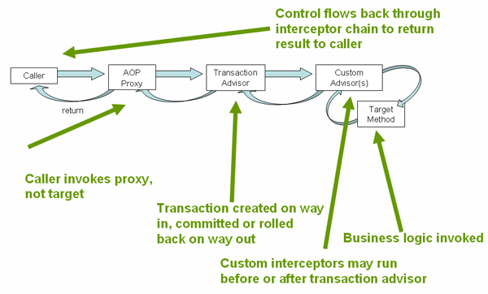

# Spring Transaction[^Transaction]
- Spring Transaction은 어노테이션 기반으로 수행이 된다.
- Spring Bean[^Bean]으로 정의 된 Method를 트랜잭션 관리를 하고자 할 때, @Transactional 어노테이션을 활용하면 프록시 패턴의 AOP[^AOP]를 사용하여 원하는 수준의 트랜잭션 관리를 할 수 있다.

# Isolation Level
- 트랜잭션에서 일관성이 없는 데이터를 다른 트랜잭션이 읽는 것을 허용하도록 하는 수준이다.

## 트랜잭션 경쟁(Race Conditiaon)에 대한 문제점
### Dirty Read
커밋 전 데이터 조회와 롤백 후 데이터 조회의 데이터 불일치 문제이다.
### Non-Repeatable Read
한 트랜잭션에서 데이터 변경 전과 후에 같은 조회 쿼리를 수행 시, 값이 변경되면서 결과가 달라지는 문제이다.
### Phantom Read
한 트랜잭션에서 데이터 추가 전과 후에 같은 조회 쿼리를 수행 시, 값이 추가되면서 결과가 달라지는 문제이다.

## 종류
기본적으로 Isolation Level이 높아질수록 데이터를 점유하는 권한이 강화되고, 이로 인해서 수행 속도는 느려진다.
### DEFAULT
- 사용하는 Database의 Isolation Level을 따라 적용 한다.
### READ_UNCOMMITED(Level 0)
- 트랜잭션에서 처리 중인 혹은 아직 커밋되지 않은 데이터를 다른 트랜잭션이 읽는 것을 허용한다.
- Dirty Read 문제가 발생한다.
### READ_COMMITED(Level 1)
- 트랜잭션이 커밋되어 확정된 데이터만을 읽는 것을 허용한다.
- Oracle, MSSQL 등의 일반적인 RDBMS에서 Default Isolation Level로 사용한다.
- Dirty Read 문제를 방지하나, Non-Repeatable Read 문제가 발생한다.
### REPREATABLE_READ(Level 2)
- 트랜잭션이 완료될 때까지 SELECT 문장이 사용하는 모든 데이터에 Shared Lock을 걸어 다른 사용자들은 그 영역의 데이터에 대한 수정이 불가능하다.
- MySQL와 같은 특정 RDBMS에서 Default Isolation Level로 사용한다.
- Dirty Read, Non-Repeatable Read의 문제들을 방지하나, Phantom Read 문제가 발생한다.
### SERIALIZABLE(Level 3)
- 트랜잭션이 완료될 때까지 SELECT 문장이 사용하는 모든 데이터에 SHared Lock을 걸어 다른 사용자들은 그 영역의 데이터에 대한 수정 및 입력이 불가능하다.
- Dirty Read, Non-Repeatable Read, Phantom Read의 문제들을 방지한다.

# Propagation
트랜잭션을 시작하거나 기존 트랜잭션에 참여하는 방법을 결정하는 속성이다.

## 종류
### REQUIRED
부모 트랜잭션 내에서 실행하며 부모 트랜잭션이 없을 경우 새로운 트랜잭션을 생성한다.
### REQUIRES_NEW
부모 트랜잭션을 무시하고 무조건 새로운 트랜잭션을 생성한다.
### SUPPPORT
부모 트랜잭션 내에서 실행하며 부모 트랜잭션이 없을 경우 Non-Transactionally로 실행한다.
### MANDATORY
부모 트랜잭션 내에서 실행되며 부모 트랜잭션이 없을 경우 Exception이 발생한다.
### NOT_SUPPORT
Non-Transactionally로 실행하며 부모 트랜잭션 내에서 실행될 경우 일시 정지한다,
### NEVER
Non-Transactionally로 실행하며 부모 트랜잭션이 존재하면 Exception이 발생한다.
### NESTED
- 부모 트랜잭션이 존재하면 부모 트랜잭션 내에서 실행되며, 별개로 커밋되거나 롤백될 수 있다.
- 부모 트랜잭션이 존재하지 않으면 RQUIRED와 동일하게 실행된다.

# Readonly
- 해당 Transaction 내에서 데이터를 읽기만 할지를 결정한다.
- Default : false

# RollbackFor/NoRollbackFor
## RollbackFor
특정 Exception을 추가 할 수 있으며, 해당 Exception이 발생하면 Rollback을 수행한다.
## NoRollbackFor
특정 Exception을 추가 할 수 있으며, 해당 Exception이 발생하면 Rollback을 수행하지 않는다.

# Timeout
- 지정한 시간 내에 해당 메서드 수행이 완료되지 않은 경우, Rollback을 수행한다.
- Default : -1(No-Timeout)

# Reference
[^Transaction]: [SpringDocs-Transaction](https://docs.spring.io/spring-framework/docs/5.0.0.M5/spring-framework-reference/html/transaction.html){:target="_blank"}
[^Bean]: [Blog-Bean](../Bean){:target="_blank"}
[^AOP]: [Blog-AOP](../aop){:target="_blank"}