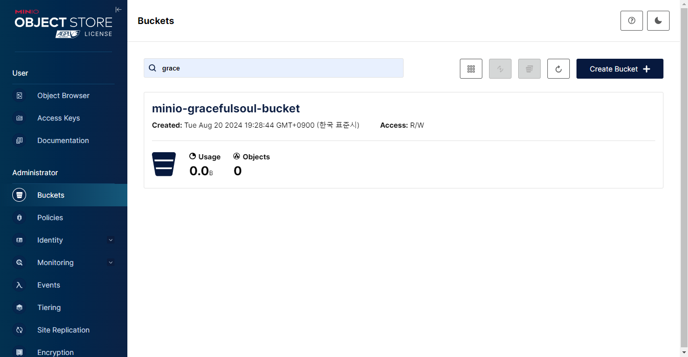
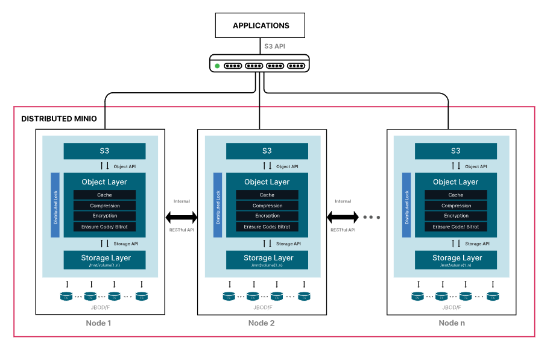
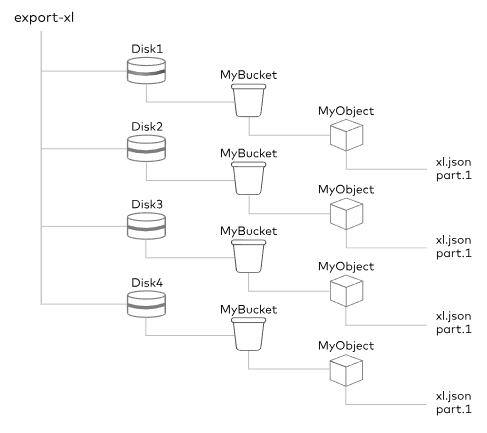
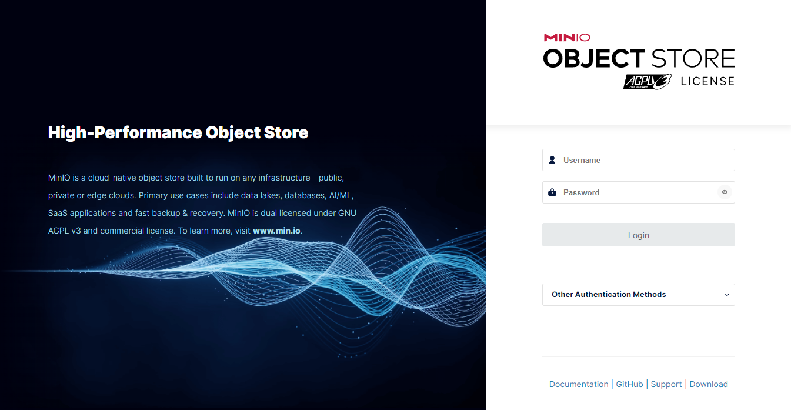

# 개요
- MinIO는 고성능 Enterprise Object Store(EOS)로 Amazon Web Services S3 기능을 모두 지원하는 객체 스토리지 솔루션이다.
- 주요 라이센스로는 AGPLv3 라이센스로 Open Source 버전과 비교적 자유적인 이점을 제공하는 상용 라이센스인 MinIO Commercial License가 존재한다.

# 주요 특징
## S3 Compatible Storage
Amazon S3 API와 완벽하게 호환되도록 설계되었으므로 스토리지 및 ID 관리를 위해 동일한 API 구성을 지원한다.

## Multi-Site, Active Active Replication for Object Storage
고가용성(HA) 구성을 지원하여 스토리지 용량과 성능을 확장하고, 다중 클러스터 구성을 통해 대규모 데이터 활용과 장애와 같은 불가항력적인 상황에 데이터를 보호할 수 있다.

## Bucket and Object Versioning
버전 관리를 통해 사용자는 동일한 버킷에 저장된 모든 객체의 모든 버전을 유지, 검색 및 복원이 가능하다. 설정을 통해 버전 관리 시작 및 중지를 자유롭게 수행하여 의도치 않은 작업으로 부터 데이터를 보호할 수 있다.

## Enterprise Grade Object Storage Encryption
디스크에 저장되거나 네트워크를 통해 전송 될 때 데이터를 AES-256-GCM, ChaCha20-Poly1305 및 AES-CBC와 같은 최신 산업 표준 암호화 알고리즘을 사용하여 암호화하며, AWS 외 Hashicorp Vault, Google Secrets Manager 등의 Key Management Services(KMS)와 연동이 가능하다.

## MinIO Enterprise Console: A Window Into Your Data Infrastructure

CLI 뿐 아니라 WEB GUI를 제공하여, 각 기능에 대한 권한을 제어할 수 있으며 모니터링과 이벤트를 실시간으로 확인할 수 있다.

## Create An In-Memory Object Store for Ultra High Performance Workloads
객체를 캐싱할 수 있는 기능을 자체적으로 제공하여 빠른 검색과 잦은 요청에 대한 부하를 절감할 수 있으며, 노드가 추가되거나 제거될 때 시스템을 정렬하기 위한 셔플링이 최소화된다.

## Data Lifecycle Management and Tiering
오브젝트의 생명 주기인 만료를 지정함으로써, 버킷 별 오브젝트 및 태그의 조합을 통해 스토리지 관리를 최적화 할 수 있다.

# 구조

- 분산 구성의 다중 MinIO를 구성하면, 각 클러스터끼리 RESTful API로 
- 독립 구성의 MinIO는 크게 세 부분으로 구성되어 있다.
  - S3 Layer는 Application으로부터 S3 API를 통해 요청을 수행받는 영역이다.
  - Object Layer는 MinIO에서 제공하는 기능들을 수행하는 영역이다.
  - Storage Layer는 File System에 직접적으로 접근하는 영역이다. 
- 각 Layer간 통신하기 위해 내부적으로 Object API와 Storage API로 통신된다.

# 저장 방식
## File System
특정 로컬 스토리지의 위치에 저장 경로를 지정하여 MinIO 서비스를 실행하는 방식으로, 해당  시스템에 대한 독점적인 엑세스가 불가능하므로 권장하는 방식이 아니다.
## Erasure Code(EC)


객체를 데이터와 패리티 셀로 분할하여 오브젝트의 손상을 복구할 때 사용하는 기법을 제공하는 방법으로, 저장소 공간을 절약하면서 안정적으로 저장 및 복원이 가능한 방식이다.

# Quickstart for Containers
## Make directory for storage
```shell
mkdir -p /data
```
- MinIO 오브젝트 저장소와 볼륨 마운트할 디렉토리를 생성한다.

## Run container using podman
```shell
docker run \
   -p 9000:9000 \
   -p 9001:9001 \
   -e "MINIO_ROOT_USER=gracefulsoul" \
   -e "MINIO_ROOT_PASSWORD=LeIabo33@!" \
   -v /home/minio/data:/data \
   --user $(id -u):$(id -g) \
   --name minio \
   quay.io/minio/minio server /data --console-address ":9001"
```
- 9000은 Server, 9001은 Console Port를 의미힌다.
- 위에서 만든 Directory Path를 컨테이너 내부 데이터 저장소 Path인 "/data"와 볼륨 마운트를 해준다.
- "MINIO_ROOT_USER"와 "MINIO_ROOT_PASSWORD"는 콘솔 관리자 계정 정보를 넣어준다.
- 현재 유저로 서비스를 수행하기 위하여 "--user" 옵션에 현재 계정의 uid:gid를 넣어준다.
- Docker Hub 내 "quay.io/minio/minio:latest" 이미지를 기반의 minio 컨테이너를 'server /data --console-address ":9001"' 커맨드로 실행한다.

## Login

도커 실행에 사용한 "MINIO_ROOT_USER"와 "MINIO_ROOT_PASSWORD"를 이용하여 로그인을 수행한다.

# 참고
[The MinIO Enterprise Object Store](https://min.io/){:target="_blank"}
